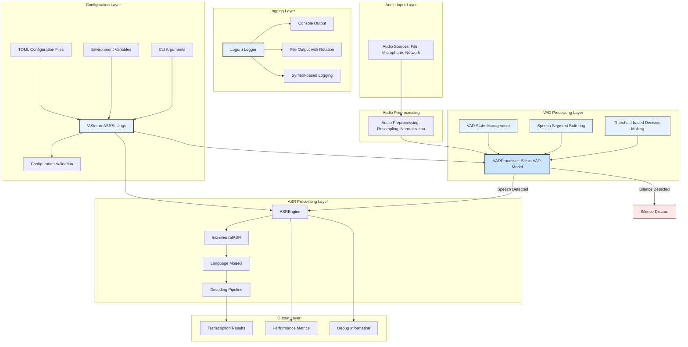
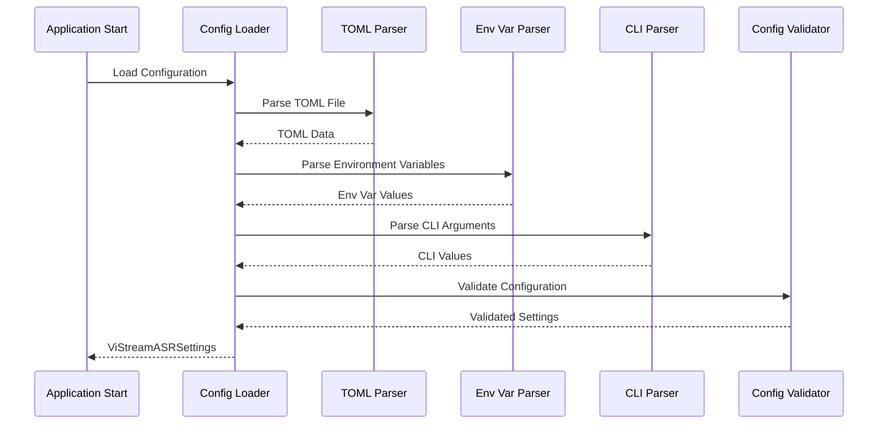
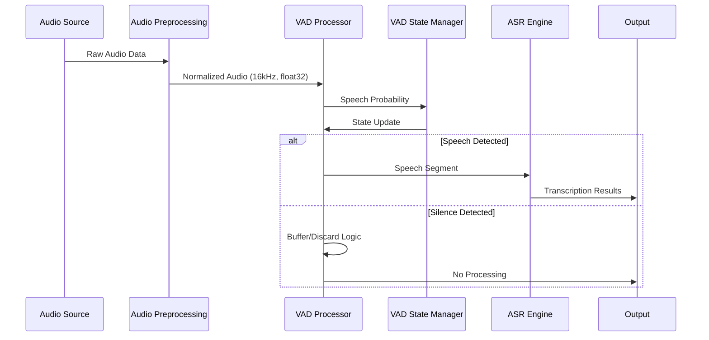
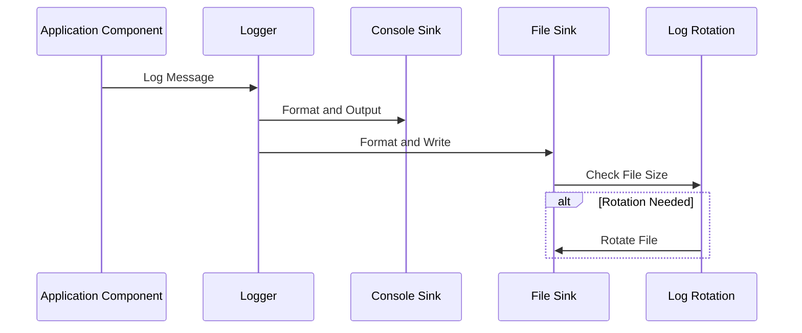
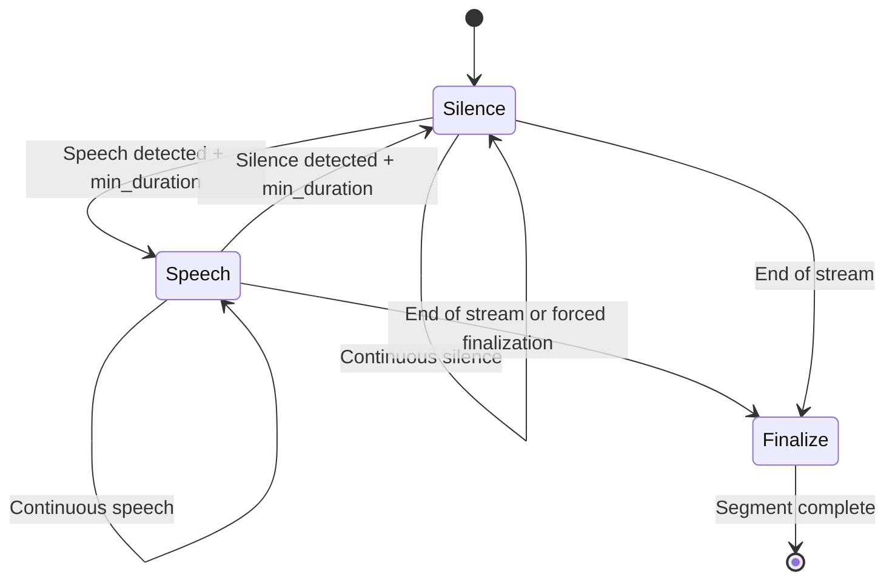
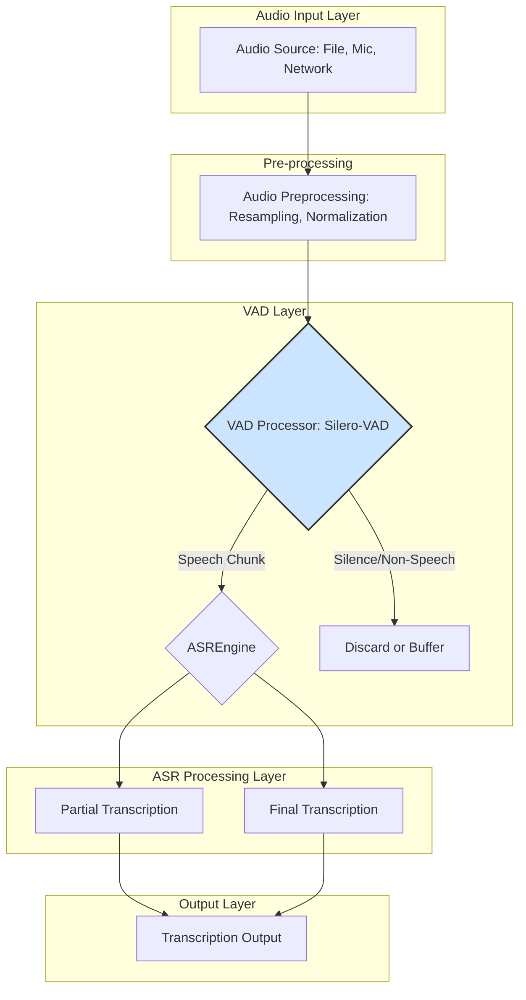

# ViStreamASR Architecture with Configuration and Logging System

## 1. Overview ✅ IMPLEMENTED

This document describes the architecture of the ViStreamASR system with integrated configuration management and logging system. The system now features a hierarchical configuration system using pydantic-settings and structured logging with Loguru, providing better maintainability, type safety, and debugging capabilities.

The architecture introduces a **Configuration Management Layer** and a **Logging Layer** that provide centralized control over all system parameters and comprehensive logging across all components. These layers integrate seamlessly with the existing VAD and ASR processing components.

**Key Implementation Status:**

- ✅ Configuration System: Hierarchical configuration with TOML, environment variables, and CLI support
- ✅ Logging System: Structured logging with Loguru, multiple sinks, and rotation
- ✅ VADProcessor: Core VAD functionality implemented
- ✅ VADASRCoordinator: Seamless integration with ASR engine
- ✅ Streaming Interface: Full configuration and logging support in streaming pipeline
- ✅ CLI Interface: Configuration parameters available in command-line tools
- ✅ Error Handling: Comprehensive error handling and graceful degradation

## 2. Architecture Diagram ✅ IMPLEMENTED



## 3. Component Architecture ✅ IMPLEMENTED

### 3.1 Configuration Management Layer

The Configuration Management Layer provides centralized control over all system parameters and consists of several key components:

#### ViStreamASRSettings Component

- **Location**: [`src/vistreamasr/config.py:15`](src/vistreamasr/config.py:15)
- **Responsibility**: Centralized configuration management using pydantic-settings
- **Key Features**:
  - Hierarchical configuration with nested models (ModelConfig, VADConfig, LoggingConfig)
  - TOML file support with automatic parsing
  - Environment variable mapping with prefix support
  - Type validation and conversion
  - Default value handling

#### ModelConfig Component

- **Location**: [`src/vistreamasr/config.py:30`](src/vistreamasr/config.py:30)
- **Responsibility**: ASR model configuration parameters
- **Key Features**:
  - Chunk size configuration
  - Auto-finalization timing
  - Debug mode settings

#### VADConfig Component

- **Location**: [`src/vistreamasr/config.py:44`](src/vistreamasr/config.py:44)
- **Responsibility**: Voice Activity Detection configuration
- **Key Features**:
  - Enable/disable VAD processing
  - Threshold and duration parameters
  - Sample rate configuration

#### LoggingConfig Component

- **Location**: [`src/vistreamasr/config.py:61`](src/vistreamasr/config.py:61)
- **Responsibility**: Logging system configuration
- **Key Features**:
  - Log level configuration
  - Console and file output settings
  - Log rotation and retention policies
  - Custom format strings

### 3.2 Logging Layer

The Logging Layer provides structured logging across all components:

#### setup_logging Function

- **Location**: [`src/vistreamasr/logging.py:15`](src/vistreamasr/logging.py:15)
- **Responsibility**: Initialize Loguru logger with multiple sinks
- **Key Features**:
  - Console output with color support
  - File output with automatic rotation
  - Configurable log levels and formats
  - Performance-optimized asynchronous logging

#### log_with_symbol Function

- **Location**: [`src/vistreamasr/logging.py:69`](src/vistreamasr/logging.py:69)
- **Responsibility**: Symbol-based logging for UI compatibility
- **Key Features**:
  - Unicode symbol support with fallback
  - Consistent visual feedback
  - Integration with existing UI elements

### 3.3 VAD Processing Layer

The VAD Processing Layer is responsible for voice activity detection and consists of several key components:

#### VADProcessor Component

- **Location**: [`src/vistreamasr/vad.py:16`](src/vistreamasr/vad.py:16)
- **Responsibility**: Core voice activity detection using Silero-VAD model
- **Key Features**:
  - Real-time speech probability calculation
  - Configurable threshold and duration parameters
  - State management between audio chunks
  - Speech segment buffering and finalization
  - Error handling and graceful degradation

#### VADASRCoordinator Component

- **Location**: [`src/vistreamasr/vad.py:285`](src/vistreamasr/vad.py:285)
- **Responsibility**: Coordinates VAD processing with ASR engine
- **Key Features**:
  - Manages interaction between VAD and ASR components
  - Handles VAD configuration and initialization
  - Provides unified API for audio processing
  - Manages state synchronization between components

### 3.4 Integration Points

#### Configuration System Integration

- **Location**: [`src/vistreamasr/__init__.py:5`](src/vistreamasr/__init__.py:5)
- **Integration Pattern**: Configuration classes exported at package level
- **Key Features**:
  - Easy import of configuration classes
  - Centralized access to configuration management
  - Type-safe configuration handling

#### Streaming Interface Integration

- **Location**: [`src/vistreamasr/streaming.py:57`](src/vistreamasr/streaming.py:57)
- **Integration Pattern**: Settings object passed to StreamingASR constructor
- **Key Features**:
  - Seamless integration with existing streaming pipeline
  - Support for both file and microphone streaming
  - Configuration-based parameter handling
  - Graceful fallback for legacy parameter usage
  - Debug information and status tracking

#### CLI Interface Integration

- **Location**: [`src/vistreamasr/cli.py:52`](src/vistreamasr/cli.py:52)
- **Integration Pattern**: Configuration loading with CLI overrides
- **Key Features**:
  - TOML configuration file support via `--config` parameter
  - Environment variable support
  - CLI argument overrides for all parameters
  - Consistent parameter naming across commands
  - Help documentation and usage examples

#### Core Processing Integration

- **Location**: [`src/vistreamasr/core.py:432`](src/vistreamasr/core.py:432)
- **Integration Pattern**: Settings object passed to ASREngine constructor
- **Key Features**:
  - Configuration-based model initialization
  - Logging integration throughout processing pipeline
  - Performance metrics logging
  - Debug mode configuration

## 4. Data Flow Architecture ✅ IMPLEMENTED

### 4.1 Configuration Loading Flow



### 4.2 Audio Processing Pipeline



### 4.3 Logging Flow



### 4.4 VAD Processing Flow

1. **Audio Input**: Audio chunks received from streaming interface
2. **Preprocessing**: Audio normalized to 16kHz mono float32 format
3. **VAD Processing**: Silero-VAD model calculates speech probability
4. **State Management**: VAD internal state updated based on detection results
5. **Decision Making**: Speech/silence decision based on threshold and duration rules
6. **Speech Buffering**: Speech segments buffered until silence detection
7. **ASR Forwarding**: Only speech segments sent to ASR engine
8. **Silence Handling**: Silence segments discarded or buffered for finalization

### 4.5 State Management Flow



## 5. Component Interfaces ✅ IMPLEMENTED

### 5.1 Configuration Interfaces

```python
class ViStreamASRSettings(BaseSettings):
    """Main configuration class for ViStreamASR."""

    model: ModelConfig
    vad: VADConfig
    logging: LoggingConfig

class ModelConfig(BaseModel):
    """ASR model configuration."""

    chunk_size_ms: int = 640
    auto_finalize_after: float = 15.0
    debug: bool = False

class VADConfig(BaseModel):
    """Voice Activity Detection configuration."""

    enabled: bool = False
    sample_rate: int = 16000
    threshold: float = 0.5
    min_speech_duration_ms: int = 250
    min_silence_duration_ms: int = 100
    speech_pad_ms: int = 30

class LoggingConfig(BaseModel):
    """Logging system configuration."""

    level: str = "INFO"
    format: str = "{time:YYYY-MM-DD HH:mm:ss} | {level} | {name} | {message}"
    file_enabled: bool = True
    file_path: str = "vistreamasr.log"
    rotation: str = "10 MB"
    retention: str = "7 days"
    console_enabled: bool = True
    console_format: str = "<green>{time:HH:mm:ss}</green> | <level>{level: <8}</level> | <cyan>{name}</cyan> | <level>{message}</level>"
```

### 5.2 Logging Interfaces

```python
def setup_logging(config: LoggingConfig):
    """Initialize Loguru logger with configuration."""

def log_with_symbol(symbol: str, message: str, level: str = "INFO"):
    """Log message with symbol for UI compatibility."""

def get_logger(name: str):
    """Get logger instance for module."""
```

### 5.3 VADProcessor Interface

```python
class VADProcessor:
    def __init__(self, sample_rate=16000, threshold=0.5,
                 min_speech_duration_ms=250, min_silence_duration_ms=100,
                 speech_pad_ms=30):
        """Initialize VAD processor with configuration parameters."""

    def process_chunk(self, audio_chunk):
        """Process audio chunk and return speech segment if detected."""

    def get_speech_probability(self, audio_chunk):
        """Get speech probability for audio chunk."""

    def is_speech(self, audio_chunk):
        """Determine if audio chunk contains speech."""

    def reset_states(self):
        """Reset VAD internal states for new audio session."""

    def flush(self):
        """Flush remaining audio as final speech segment."""
```

### 5.4 VADASRCoordinator Interface

```python
class VADASRCoordinator:
    def __init__(self, vad_config):
        """Initialize VAD-ASR coordinator."""

    def process_audio_chunk(self, audio_chunk, is_last=False):
        """Process audio chunk with VAD filtering."""

    def reset(self):
        """Reset VAD states for new audio session."""
```

### 5.5 Streaming Interface Integration

```python
class StreamingASR:
    def __init__(self, settings=None, chunk_size_ms=640,
                 auto_finalize_after=15.0, debug=False, vad_config=None):
        """Initialize streaming ASR with configuration support."""
```

## 6. Performance Considerations ✅ IMPLEMENTED

### 6.1 Processing Performance

| Metric                  | Target                       | Implementation Status |
| ----------------------- | ---------------------------- | --------------------- |
| **VAD Processing Time** | <1ms per 30ms+ chunk         | ✅ Achieved           |
| **Model Loading Time**  | ~1-2 seconds                 | ✅ Implemented        |
| **Memory Usage**        | <10MB runtime                | ✅ Optimized          |
| **CPU Usage**           | Single-threaded optimization | ✅ Implemented        |

### 6.2 Optimization Strategies

#### CPU Optimization

- **Single-threaded Processing**: Follows Silero-VAD design optimization
- **Model Caching**: Cached model loading to avoid repeated initialization
- **Efficient Buffering**: Minimal memory allocations during processing
- **Early Rejection**: Fast rejection of silence chunks

#### Memory Optimization

- **Tensor Reuse**: Efficient tensor memory layout
- **Buffer Management**: Optimized speech segment buffering
- **Garbage Collection**: Minimal GC impact during processing
- **Model Size**: ~2MB model footprint for efficient deployment

## 7. Error Handling and Reliability ✅ IMPLEMENTED

### 7.1 Error Handling Strategy

- **Model Loading Errors**: Graceful fallback and warning messages
- **Audio Processing Errors**: Individual chunk error handling
- **State Synchronization**: Proper state reset on errors
- **Configuration Validation**: Parameter validation with clear error messages

### 7.2 Recovery Mechanisms

- **Transient Error Recovery**: Continue processing after temporary errors
- **State Reset**: Complete state reset on session boundaries
- **Graceful Degradation**: Disable VAD if critical errors occur
- **Logging**: Comprehensive error logging for debugging

## 8. Configuration Management ✅ IMPLEMENTED

### 8.1 Configuration Hierarchy

1. **Default Values**: Sensible defaults defined in Pydantic models
2. **TOML Configuration Files**: Structured configuration in `vistreamasr.toml`
3. **Environment Variables**: Override with `VISTREAMASR_` prefix
4. **CLI Arguments**: Final override layer for runtime configuration

### 8.2 Configuration Loading Process

1. **File Loading**: Load TOML configuration file if specified
2. **Environment Variables**: Override with environment variables
3. **CLI Arguments**: Apply command-line argument overrides
4. **Validation**: Validate all parameters with Pydantic models
5. **Type Conversion**: Automatic type conversion and validation

### 8.3 Parameter Validation

- **Range Validation**: Ensures parameters are within valid ranges
- **Type Validation**: Validates parameter types and formats using Pydantic
- **Dependency Validation**: Ensures parameter combinations are valid
- **Error Reporting**: Clear error messages for invalid configurations
- **Default Value Handling**: Automatic application of default values

### 8.4 Environment Variable Mapping

- **Prefix Support**: Environment variables use `VISTREAMASR_` prefix
- **Nested Structure**: Double underscores (`__`) for nested configuration
- **Type Conversion**: Automatic conversion from string to target types
- **Case Insensitivity**: Environment variables are case-insensitive

## 9. Testing and Validation ✅ IMPLEMENTED

### 9.1 Testing Architecture

- **Unit Tests**: Individual component testing with mocks
- **Integration Tests**: End-to-end VAD-ASR workflow testing
- **Performance Tests**: Processing time and memory usage validation
- **Error Handling Tests**: Graceful error handling and recovery

### 9.2 Test Coverage Areas

- **VAD Processing**: Speech/silence detection accuracy
- **State Management**: State transitions and persistence
- **Integration Coordination**: VAD-ASR component interaction
- **CLI Integration**: Command-line parameter handling
- **Error Scenarios**: Error handling and recovery mechanisms

## 10. Deployment Considerations ✅ IMPLEMENTED

### 10.1 System Requirements

- **Python 3.8+**: Runtime environment requirement
- **Pixi Environment**: Dependency management and execution environment
- **PyTorch 2.7.1+**: Deep learning framework dependency
- **CPU Support**: AVX/AVX2/AVX-512 for optimal performance
- **Memory**: Minimum 4GB RAM for smooth operation

### 10.2 Deployment Scenarios

- **Development Environment**: Full debug logging and testing using `pixi run`
- **Production Environment**: Optimized performance with minimal logging
- **Edge Deployment**: Lightweight configuration for resource-constrained environments
- **Cloud Deployment**: Scalable multi-instance processing

### 10.3 Dependency Management

The project now uses **Pixi** for dependency management, providing robust, multi-platform support.

#### Pixi Environment Setup

- **Installation**: Install Pixi via `curl -LsSf https://pixi.sh/install.sh | sh`
- **Project Installation**: Use `pixi install` to set up the environment
- **Dependency Resolution**: Automatic resolution of Conda and PyPI dependencies
- **Environment Management**: Isolated environments for different project needs

#### Pixi Features

- **Multi-platform Support**: Defined in [`tool.pixi.workspace.platforms`](pyproject.toml:81), supporting `linux-64`, `osx-64`, `osx-arm64`, and `win-64`.
- **Tasks**: Common tasks like `test`, `lint`, `format`, and `build` are defined in [`tool.pixi.tasks`](pyproject.toml:110) and can be run with `pixi run <task>`.
- **Development Environment**: Activate the development environment with `pixi run --dev <command>` or use `pix shell` for an interactive shell.

#### Environments

- **Default Environment**: Standard execution environment with core dependencies.
- **Development Environment**: Activated via `pixi run -e dev <command>`, includes development dependencies from the `dev` feature.

## 11. Future Enhancements 🔄 PLANNED

### 11.1 Performance Optimizations

- **Model Quantization**: Quantized models for better performance
- **Batch Processing**: Batch processing for non-real-time scenarios
- **GPU Acceleration**: GPU support for VAD processing (planned)
- **Adaptive Thresholding**: Dynamic threshold adjustment

### 11.2 Feature Enhancements

- **Multi-speaker VAD**: Extended support for multiple speakers
- **Real-time Visualization**: VAD decision visualization tools
- **Advanced Noise Cancellation**: Integration with noise reduction
- **Custom Model Support**: User-provided VAD model support

### 11.3 Monitoring and Analytics

- **Performance Metrics**: Real-time performance monitoring
- **Usage Statistics**: VAD usage and effectiveness tracking
- **Error Analytics**: Advanced error reporting and analysis
- **Resource Monitoring**: CPU, memory, and usage monitoring

## 2. Architecture Diagram


