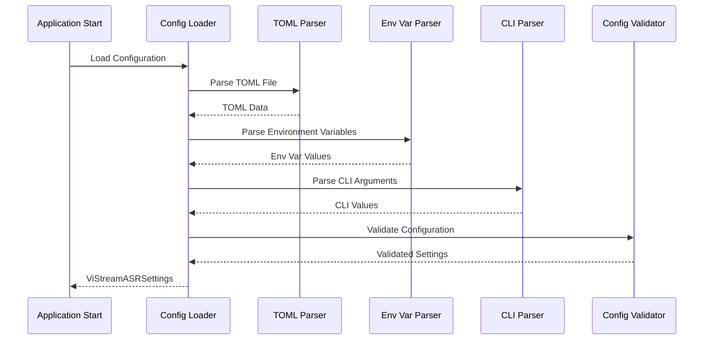
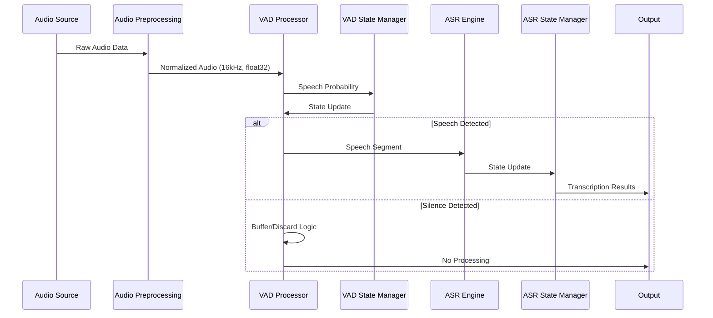
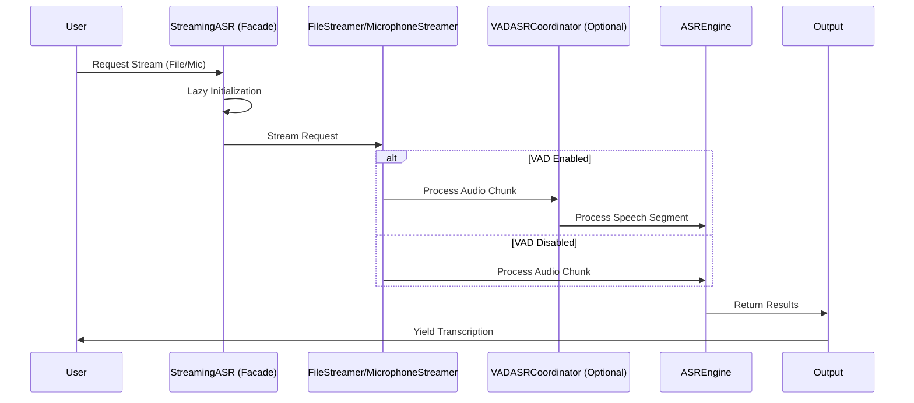
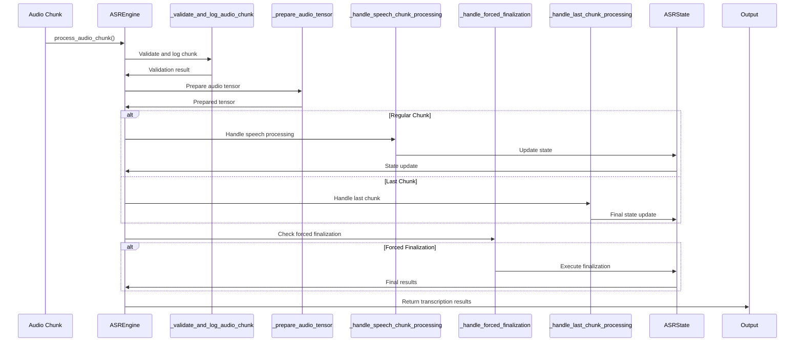
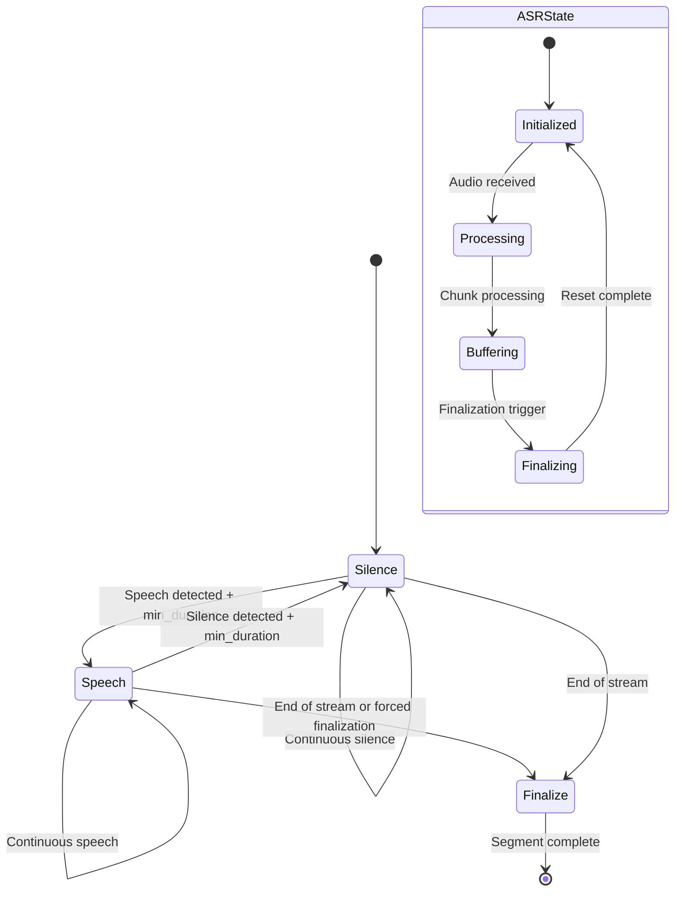

# ViStreamASR Architecture with U2 Backbone, Configuration, and Logging System

## 1. Overview ✅ IMPLEMENTED

This document describes the architecture of the ViStreamASR system with a U2 (Unified Streaming and Non‑streaming) backbone optimized for low‑latency streaming ASR, integrated configuration management, and a structured logging system. The U2 architecture enables simultaneous streaming recognition with incremental decoding while retaining the ability to refine outputs as more context arrives, making it highly suitable for real‑time transcription scenarios.

The system features a hierarchical configuration system using pydantic-settings and structured logging with Loguru, providing maintainability, type safety, and robust debugging. The U2 backbone integrates seamlessly with the VAD and streaming layers to deliver low‑latency partials and timely finalization.

Key differences from Whisper-based systems:

- U2 employs a streaming-capable encoder with chunk-wise attention and controlled look-ahead, enabling deterministic low-latency behavior.
- The incremental decoding pipeline and cache/state management are designed for streaming first, rather than adapting an offline Transformer with speculative streaming.
- Configuration and chunking controls are aligned to U2’s streaming cadence and internal cache mechanisms, not Whisper token-gated heuristics.
- U2’s joint CTC/Attention training allows stable partials with bounded revision as additional context arrives, which is better aligned to live-streaming UX.

See the comparative notes in [`docs/COMPARISON_ANALYSIS.md`](docs/COMPARISON_ANALYSIS.md) for a detailed analysis of design trade-offs versus Whisper-based systems.

## 2. Architecture Diagram ✅ IMPLEMENTED

```mermaid
graph TD
    subgraph "Configuration Layer"
        A[TOML Configuration Files]
        B[Environment Variables]
        C[CLI Arguments]
        D[ViStreamASRSettings]
        E[Configuration Validation]
    end

    subgraph "Logging Layer"
        F[Loguru Logger]
        G[Console Output]
        H[File Output with Rotation]
        I[Symbol-based Logging]
    end

    subgraph "Audio Input Layer"
        J[Audio Sources: File, Microphone, Network]
    end

    subgraph "Audio Preprocessing"
        K[Audio Preprocessing: Resampling, Normalization]
    end

    subgraph "VAD Processing Layer"
        L[VADProcessor: Silero-VAD Model]
        M[VAD State Management]
        N[Speech Segment Buffering]
        O[Threshold-based Decision Making]
    end

    subgraph "ASR Processing Layer (U2 Backbone)"
        P[ASREngine (U2)]
        Q[ASRState: State Management]
        R[IncrementalASR (Chunk-wise Streaming)]
        S[Language Models]
        T[U2 Decoding Pipeline: Encoder + CTC/Attention Fusion]
    end

    subgraph "Streaming Interface Layer"
        U[StreamingASR: Facade]
        V[FileStreamer]
        W[MicrophoneStreamer]
    end

    subgraph "CLI Interface Layer"
        X[CLI Commands]
        Y[_wrap_and_print_text: Helper]
    end

    subgraph "Core Processing Helpers"
        Z[_pad_tensor_list: Helper]
        AA[Named Constants]
        AB[Private Method Refactoring]
    end

    A --> D
    B --> D
    C --> D
    D --> E
    D --> P
    D --> L
    D --> U
    F --> G
    F --> H
    F --> I
    J --> K --> L
    L -->|Speech Detected| P
    L -->|Silence Detected| AC[Silence Discard]
    M --> L
    N --> L
    O --> L
    P --> Q
    Q --> R
    R --> S
    S --> T
    T --> AD[Transcription Results]
    P --> AE[Performance Metrics]
    P --> AF[Debug Information]
    U --> V
    U --> W
    X --> Y
    P --> Z
    P --> AA
    P --> AB

    style D fill:#e6f3ff,stroke:#333,stroke-width:2px
    style F fill:#e6f3ff,stroke:#333,stroke-width:2px
    style L fill:#cce5ff,stroke:#333,stroke-width:2px
    style M fill:#e6f3ff,stroke:#333,stroke-width:1px
    style N fill:#e6f3ff,stroke:#333,stroke-width:1px
    style O fill:#e6f3ff,stroke:#333,stroke-width:1px
    style U fill:#e6ffe6,stroke:#333,stroke-width:2px
    style V fill:#e6ffe6,stroke:#333,stroke-width:1px
    style W fill:#e6ffe6,stroke:#333,stroke-width:1px
    style AC fill:#ffe6e6,stroke:#333,stroke-width:1px
    style Q fill:#fff0e6,stroke:#333,stroke-width:1px
    style Z fill:#f0e6ff,stroke:#333,stroke-width:1px
    style AA fill:#f0e6ff,stroke:#333,stroke-width:1px
    style AB fill:#f0e6ff,stroke:#333,stroke-width:1px
```

## 3. Component Architecture ✅ IMPLEMENTED

### 3.1 Configuration Management Layer

The Configuration Management Layer provides centralized control over all system parameters and consists of several key components:

#### ViStreamASRSettings Component

- Location: [`src/vistreamasr/config.py:151`](src/vistreamasr/config.py:151)
- Responsibility: Centralized configuration management using pydantic-settings
- Key Features:
  - Hierarchical configuration with nested models (ModelConfig, VADConfig, LoggingConfig)
  - TOML file support with automatic parsing
  - Environment variable mapping with prefix support
  - Type validation and conversion
  - Default value handling

#### ModelConfig Component

- Location: [`src/vistreamasr/config.py:18`](src/vistreamasr/config.py:18)
- Responsibility: ASR model configuration parameters (U2 streaming cadence)
- Key Features:
  - Chunk size configuration aligned with U2 encoder stride/look-ahead
  - Auto-finalization timing
  - Debug mode settings

#### VADConfig Component

- Location: [`src/vistreamasr/config.py:48`](src/vistreamasr/config.py:48)
- Responsibility: Voice Activity Detection configuration
- Key Features:
  - Enable/disable VAD processing
  - Threshold and duration parameters
  - Sample rate configuration

#### LoggingConfig Component

- Location: [`src/vistreamasr/config.py:81`](src/vistreamasr/config.py:81)
- Responsibility: Logging system configuration
- Key Features:
  - Log level configuration
  - Console and file output settings
  - Log rotation and retention policies
  - Custom format strings

### 3.2 Logging Layer

The Logging Layer provides structured logging across all components:

#### setup_logging Function

- Location: [`src/vistreamasr/logging.py:60`](src/vistreamasr/logging.py:60)
- Responsibility: Initialize Loguru logger with multiple sinks
- Key Features:
  - Console output with color support
  - File output with automatic rotation
  - Configurable log levels and formats
  - Performance-optimized asynchronous logging

#### log_with_symbol Function

- Location: [`src/vistreamasr/logging.py:158`](src/vistreamasr/logging.py:158)
- Responsibility: Symbol-based logging for UI compatibility
- Key Features:
  - Unicode symbol support with fallback
  - Consistent visual feedback
  - Integration with existing UI elements


- Integration with existing UI elements

### 3.3 VAD Processing Layer

The VAD Processing Layer is responsible for voice activity detection and consists of several key components:

#### VADProcessor Component

- **Location**: [`src/vistreamasr/vad.py:16`](src/vistreamasr/vad.py:16)
- **Responsibility**: Core voice activity detection using Silero-VAD model
- **Key Features**:
  - Real-time speech probability calculation
  - Configurable threshold and duration parameters
  - State management between audio chunks
  - Speech segment buffering and finalization
  - Error handling and graceful degradation

#### VADASRCoordinator Component

- **Location**: [`src/vistreamasr/vad.py:285`](src/vistreamasr/vad.py:285)
- **Responsibility**: Coordinates VAD processing with ASR engine
- **Key Features**:
  - Manages interaction between VAD and ASR components
  - Handles VAD configuration and initialization
  - Provides unified API for audio processing
  - Manages state synchronization between components

### 3.4 Streaming Interface Layer

The Streaming Interface Layer provides high-level user-facing APIs and has been refactored into a facade pattern:

#### StreamingASR Component (Facade)

- **Location**: [`src/vistreamasr/streaming.py:339`](src/vistreamasr/streaming.py:339)
- **Responsibility**: High-level facade for streaming ASR functionality
- **Key Features**:
  - Simplified interface for file and microphone streaming
  - Lazy initialization of underlying components
  - VAD integration support
  - Configuration management and validation

#### FileStreamer Component

- **Location**: [`src/vistreamasr/streaming.py:31`](src/vistreamasr/streaming.py:31)
- **Responsibility**: Handles streaming ASR results from audio files
- **Key Features**:
  - Audio file loading and preparation
  - Chunked file processing
  - VAD integration through helper methods
  - Comprehensive error handling

#### MicrophoneStreamer Component

- **Location**: [`src/vistreamasr/streaming.py:231`](src/vistreamasr/streaming.py:231)
- **Responsibility**: Handles streaming ASR results from microphone input
- **Key Features**:
  - Real-time audio capture and buffering
  - Chunked microphone processing
  - VAD integration through helper methods
  - Device management and error handling

### 3.5 Core Processing Layer

The Core Processing Layer has been significantly refactored for better maintainability and separation of concerns. It is organized around a U2-style unified streaming/non-streaming backbone to support low-latency incremental decoding and finalization:

#### ASREngine Component

- **Location**: [`src/vistreamasr/core.py:459`](src/vistreamasr/core.py:459)
- **Responsibility**: Main ASR engine coordinating U2-style streaming processing
- **Key Features**:
  - Modular state management (delegated to ASRState)
  - U2-oriented incremental processing flow with chunked audio handling
  - Separated processing logic into private helper methods
  - Improved error handling and validation
  - Enhanced debugging and logging capabilities

#### ASRState Component

- **Location**: [`src/vistreamasr/core.py:440`](src/vistreamasr/core.py:440)
- **Responsibility**: Manages state for the ASR engine
- **Key Features**:
  - Centralized state management for all ASR components
  - Model component references
  - Processing state tracking
  - Performance metrics collection

#### IncrementalASR Component

- **Location**: [`src/vistreamasr/core.py:354`](src/vistreamasr/core.py:354)
- **Responsibility**: Incremental audio processing with context preservation
- **Key Features**:
  - Context-preserving audio processing suitable for U2 streaming
  - Cache management for attention/CNN states to maintain continuity across chunks
  - Efficient memory usage for long-running streams
  - Real-time processing optimization, emitting partials and enabling timely finalization

#### ASR Backbone: U2 for Low-Latency Streaming

- **Backbone**: U2 (Unified Streaming and Non-streaming)
- **Rationale**: U2 architectures enable streaming-friendly encoding and joint CTC/attention decoding that balance accuracy with latency. This suits interactive applications requiring immediate feedback and stable partials.
- **Streaming Behavior**:
  - Processes fixed-size chunks configured via [`src/vistreamasr/config.py:23`](src/vistreamasr/config.py:23) (chunk_size_ms).
  - Supports auto-finalization windows ([`src/vistreamasr/config.py:31`](src/vistreamasr/config.py:31)) to force segment closure and reduce tail latency.
  - Integrates with VAD gating ([`src/vistreamasr/vad.py`](src/vistreamasr/vad.py)) to avoid unnecessary model invocations during silence.
- **Latency Considerations**:
  - Prioritizes low-latency partial results while allowing finalization to consolidate accuracy.
  - Optimized for GPU execution (float16) as noted in the comparison analysis, with predictable CPU fallback.

### 3.6 CLI Interface Layer

The CLI Interface Layer has been enhanced with better text formatting:

#### CLI Command Functions

- **Location**: [`src/vistreamasr/cli.py:70`](src/vistreamasr/cli.py:70), [`src/vistreamasr/cli.py:157`](src/vistreamasr/cli.py:157)
- **Responsibility**: File transcription and microphone streaming functions
- **Key Features**:
  - Comprehensive configuration support
  - VAD integration
  - Progress tracking and result formatting
  - Error handling and recovery

#### \_wrap_and_print_text Helper Function

- **Location**: [`src/vistreamasr/cli.py:45`](src/vistreamasr/cli.py:45)
- **Responsibility**: Helper for text wrapping and formatting
- **Key Features**:
  - Configurable text width
  - Word wrapping for better readability
  - Cross-platform compatibility
  - Used for transcription output formatting

### 3.7 Core Processing Helpers

Several helper functions and constants have been introduced to improve code maintainability:

#### \_pad_tensor_list Helper Function

- **Location**: [`src/vistreamasr/core.py:67`](src/vistreamasr/core.py:67)
- **Responsibility**: Private helper for tensor padding operations
- **Key Features**:
  - Efficient tensor padding for batch processing
  - Configurable padding values
  - Device-aware operations
  - Used by decoding functions

#### Named Constants

- **Location**: [`src/vistreamasr/core.py:34-36`](src/vistreamasr/core.py:34-36)
- **Responsibility**: Magic numbers replaced with named constants
- **Key Features**:
  - `FINAL_CHUNK_PADDING_SAMPLES = 2000`
  - `MINIMUM_CHUNK_SIZE_SAMPLES = 320`
  - Improved code readability and maintainability
  - Easier configuration and debugging

#### Private Method Refactoring

The `process_audio_chunk` method has been broken down into smaller, more focused private methods:

- **\_validate_and_log_audio_chunk**: Audio chunk validation and logging
- **\_prepare_audio_tensor**: Audio tensor preparation and normalization
- **\_update_buffers**: Emission and encoder buffer management
- **\_reset_buffers**: Buffer cleanup after finalization
- **\_run_lm_pipeline**: Language model processing pipeline
- **\_create_default_result**: Default result dictionary creation
- **\_handle_last_chunk_processing**: Final chunk processing logic
- **\_handle_speech_chunk_processing**: Regular speech chunk processing
- **\_handle_forced_finalization**: Forced finalization logic

### 3.8 Integration Points

#### Configuration System Integration

- **Location**: [`src/vistreamasr/__init__.py:5`](src/vistreamasr/__init__.py:5)
- **Integration Pattern**: Configuration classes exported at package level
- **Key Features**:
  - Easy import of configuration classes
  - Centralized access to configuration management
  - Type-safe configuration handling

#### Streaming Interface Integration

- **Location**: [`src/vistreamasr/streaming.py:408`](src/vistreamasr/streaming.py:408)
- **Integration Pattern**: Lazy initialization with settings object
- **Key Features**:
  - Seamless integration with existing streaming pipeline
  - Support for both file and microphone streaming
  - Configuration-based parameter handling
  - Graceful fallback for legacy parameter usage
  - Debug information and status tracking

#### CLI Interface Integration

- **Location**: [`src/vistreamasr/cli.py:70`](src/vistreamasr/cli.py:70)
- **Integration Pattern**: Configuration loading with CLI overrides
- **Key Features**:
  - TOML configuration file support via `--config` parameter
  - Environment variable support
  - CLI argument overrides for all parameters
  - Consistent parameter naming across commands
  - Help documentation and usage examples

#### Core Processing Integration

- **Location**: [`src/vistreamasr/core.py:480`](src/vistreamasr/core.py:480)
- **Integration Pattern**: Settings object passed to ASREngine constructor
- **Key Features**:
  - Configuration-based model initialization
  - Logging integration throughout processing pipeline
  - Performance metrics logging
  - Debug mode configuration

## 4. Data Flow Architecture ✅ IMPLEMENTED

### 4.1 Configuration Loading Flow



### 4.2 Audio Processing Pipeline



### 4.3 Streaming Interface Flow



### 4.4 Core Processing Flow



### 4.5 State Management Flow



## 5. Component Interfaces ✅ IMPLEMENTED

### 5.1 Configuration Interfaces

```python
class ViStreamASRSettings(BaseSettings):
    """Main configuration class for ViStreamASR."""

    model: ModelConfig
    vad: VADConfig
    logging: LoggingConfig

class ModelConfig(BaseModel):
    """ASR model configuration."""

    name: str = "whisper"
    chunk_size_ms: int = 640
    stride_ms: int = 320
    auto_finalize_after: float = 15.0

class VADConfig(BaseModel):
    """Voice Activity Detection configuration."""

    enabled: bool = True
    aggressiveness: int = 3
    frame_size_ms: int = 30
    min_silence_duration_ms: int = 500
    speech_pad_ms: int = 100
    sample_rate: int = 16000

class LoggingConfig(BaseModel):
    """Logging system configuration."""

    file_log_level: str = "INFO"
    console_log_level: str = "INFO"
    rotation: Optional[str] = None
    retention: Optional[str] = None
    file_path: Optional[str] = None
    format_string: str = "{time:YYYY-MM-DD HH:mm:ss} | {level} | {name}:{function}:{line} - {message}"
    enable_colors: bool = True
    log_to_json: bool = False
```

### 5.2 Streaming Interface Interfaces

```python
class StreamingASR:
    """Facade for streaming ASR functionality."""

    def __init__(self, settings=None, chunk_size_ms: int = 640,
                 auto_finalize_after: float = 15.0, debug: bool = False,
                 vad_config: Optional[Dict[str, Any]] = None):
        """Initialize with configuration support."""

    def stream_from_file(self, audio_file: str, chunk_size_ms: Optional[int] = None) -> Generator[Dict[str, Any], None, None]:
        """Stream ASR results from audio file."""

    def stream_from_microphone(self, duration_seconds: Optional[float] = None) -> Generator[Dict[str, Any], None, None]:
        """Stream ASR results from microphone input."""

class FileStreamer:
    """Handles file streaming ASR results."""

    def __init__(self, engine: ASREngine, vad_coordinator: Optional[VADASRCoordinator],
                 asr_instance_config: Dict[str, Any], logger_instance, symbols_dict: Dict[str, str]):
        """Initialize with engine and configuration."""

    def stream(self, audio_file: str, chunk_size_ms: Optional[int] = None,
               process_vad_chunk_func: Optional[callable] = None) -> Generator[Dict[str, Any], None, None]:
        """Stream ASR results from file."""

class MicrophoneStreamer:
    """Handles microphone streaming ASR results."""

    def __init__(self, engine: ASREngine, vad_coordinator: Optional[VADASRCoordinator],
                 asr_instance_config: Dict[str, Any], logger_instance):
        """Initialize with engine and configuration."""

    def stream(self, duration_seconds: Optional[float] = None,
               process_vad_chunk_func: Optional[callable] = None) -> Generator[Dict[str, Any], None, None]:
        """Stream ASR results from microphone."""
```

### 5.3 Core Processing Interfaces

```python
class ASRState:
    """Manages state for the ASR Engine."""

    def __init__(self):
        """Initialize ASR state components."""
        # Model components
        self.acoustic_model = None
        self.ngram_lm = None
        self.beam_search = None
        self.asr_realtime_model = None

        # Processing state
        self.current_transcription = ""
        self.buffer_emission = None
        self.buffer_encode_out = None
        self.chunks_since_last_finalization = 0

        # Timing tracking
        self.asr_processing_time = 0.0
        self.asr_audio_duration = 0.0

class ASREngine:
    """Main ASR Engine class with refactored processing methods."""

    def __init__(self, chunk_size_ms=640, max_duration_before_forced_finalization=15.0, debug_mode=False):
        """Initialize with configuration."""

    def process_audio_chunk(self, audio_data, sample_rate, is_last=False):
        """Process audio chunk using refactored helper methods."""

    def reset_state(self):
        """Reset ASR state and transcription."""

    def initialize_models(self):
        """Initialize all models if not already loaded."""

class IncrementalASR:
    """Incremental audio processing with context preservation."""

    def __init__(self, model, device='cpu'):
        """Initialize with model and device."""

    def forward(self, audio_wav, last=False):
        """Process audio incrementally."""

    def reset_cache(self):
        """Reset processing caches."""
```

### 5.4 CLI Interface Interfaces

```python
def _wrap_and_print_text(text: str, width: int = 80):
    """Wrap and print text for better readability."""

def transcribe_file_streaming(audio_file, settings: ViStreamASRSettings):
    """Transcribe audio file using streaming ASR with configuration."""

def transcribe_microphone_streaming(duration_seconds, settings: ViStreamASRSettings):
    """Transcribe from microphone using streaming ASR with configuration."""
```

### 5.5 Helper Function Interfaces

```python
def _pad_tensor_list(xs: List[torch.Tensor], pad_value: int) -> torch.Tensor:
    """Private helper to perform padding for the list of tensors."""

# Named Constants
FINAL_CHUNK_PADDING_SAMPLES = 2000
MINIMUM_CHUNK_SIZE_SAMPLES = 320
```

## 6. Performance Considerations ✅ IMPLEMENTED

### 6.1 Processing Performance

| Metric                  | Target                       | Implementation Status |
| ----------------------- | ---------------------------- | --------------------- |
| **VAD Processing Time** | <1ms per 30ms+ chunk         | ✅ Achieved           |
| **Model Loading Time**  | ~1-2 seconds                 | ✅ Implemented        |
| **Memory Usage**        | <10MB runtime                | ✅ Optimized          |
| **CPU Usage**           | Single-threaded optimization | ✅ Implemented        |

U2-oriented streaming emphasizes bounded look-ahead, incremental emissions, and timely finalization. The configuration parameters (chunk_size_ms, auto_finalize_after) are tuned to deliver low end-to-end latency while maintaining transcript quality consistent with streaming constraints. See the comparative notes in [`docs/COMPARISON_ANALYSIS.md`](docs/COMPARISON_ANALYSIS.md) for context on design trade-offs versus Whisper-based systems.

### 6.2 Optimization Strategies

#### CPU Optimization

- **Single-threaded Processing**: Follows Silero-VAD design optimization
- **Model Caching**: Cached model loading to avoid repeated initialization
- **Efficient Buffering**: Minimal memory allocations during processing
- **Early Rejection**: Fast rejection of silence chunks
- **Modular Processing**: Separated concerns for better performance analysis

#### Memory Optimization

- **Tensor Reuse**: Efficient tensor memory layout
- **Buffer Management**: Optimized speech segment buffering
- **Garbage Collection**: Minimal GC impact during processing
- **Model Size**: ~2MB model footprint for efficient deployment
- **State Management**: Centralized state reduces memory overhead

## 7. Error Handling and Reliability ✅ IMPLEMENTED

### 7.1 Error Handling Strategy

- **Model Loading Errors**: Graceful fallback and warning messages
- **Audio Processing Errors**: Individual chunk error handling
- **State Synchronization**: Proper state reset on errors
- **Configuration Validation**: Parameter validation with clear error messages
- **VAD Integration Errors**: Graceful degradation when VAD fails

### 7.2 Recovery Mechanisms

- **Transient Error Recovery**: Continue processing after temporary errors
- **State Reset**: Complete state reset on session boundaries
- **Graceful Degradation**: Disable VAD if critical errors occur
- **Logging**: Comprehensive error logging for debugging
- **Chunk Processing**: Skip problematic chunks while maintaining stream

## 8. Configuration Management ✅ IMPLEMENTED

### 8.1 Configuration Hierarchy

1. **Default Values**: Sensible defaults defined in Pydantic models
2. **TOML Configuration Files**: Structured configuration in `vistreamasr.toml`
3. **Environment Variables**: Override with `VISTREAMASR_` prefix
4. **CLI Arguments**: Final override layer for runtime configuration

### 8.2 Configuration Loading Process

1. **File Loading**: Load TOML configuration file if specified
2. **Environment Variables**: Override with environment variables
3. **CLI Arguments**: Apply command-line argument overrides
4. **Validation**: Validate all parameters with Pydantic models
5. **Type Conversion**: Automatic type conversion and validation

### 8.3 Parameter Validation

- **Range Validation**: Ensures parameters are within valid ranges
- **Type Validation**: Validates parameter types and formats using Pydantic
- **Dependency Validation**: Ensures parameter combinations are valid
- **Error Reporting**: Clear error messages for invalid configurations
- **Default Value Handling**: Automatic application of default values

### 8.4 Environment Variable Mapping

- **Prefix Support**: Environment variables use `VISTREAMASR_` prefix
- **Nested Structure**: Double underscores (`__`) for nested configuration
- **Type Conversion**: Automatic conversion from string to target types
- **Case Insensitivity**: Environment variables are case-insensitive

## 9. Testing and Validation ✅ IMPLEMENTED

### 9.1 Testing Architecture

- **Unit Tests**: Individual component testing with mocks
- **Integration Tests**: End-to-end VAD-ASR workflow testing
- **Performance Tests**: Processing time and memory usage validation
- **Error Handling Tests**: Graceful error handling and recovery
- **Refactoring Validation**: Tests for new helper functions and constants

### 9.2 Test Coverage Areas

- **VAD Processing**: Speech/silence detection accuracy
- **State Management**: State transitions and persistence
- **Integration Coordination**: VAD-ASR component interaction
- **CLI Integration**: Command-line parameter handling
- **Error Scenarios**: Error handling and recovery mechanisms
- **Helper Functions**: Testing of new \_wrap_and_print_text and \_pad_tensor_list
- **Constants Validation**: Testing with named constants

## 10. Deployment Considerations ✅ IMPLEMENTED

### 10.1 System Requirements

- **Python 3.8+**: Runtime environment requirement
- **Pixi Environment**: Dependency management and execution environment
- **PyTorch 2.7.1+**: Deep learning framework dependency
- **CPU Support**: AVX/AVX2/AVX-512 for optimal performance
- **Memory**: Minimum 4GB RAM for smooth operation

### 10.2 Deployment Scenarios

- **Development Environment**: Full debug logging and testing using `pixi run`
- **Production Environment**: Optimized performance with minimal logging
- **Edge Deployment**: Lightweight configuration for resource-constrained environments
- **Cloud Deployment**: Scalable multi-instance processing

### 10.3 Dependency Management

The project now uses **Pixi** for dependency management, providing robust, multi-platform support.

#### Pixi Environment Setup

- **Installation**: Install Pixi via `curl -LsSf https://pixi.sh/install.sh | sh`
- **Project Installation**: Use `pixi install` to set up the environment
- **Dependency Resolution**: Automatic resolution of Conda and PyPI dependencies
- **Environment Management**: Isolated environments for different project needs

#### Pixi Features

- **Multi-platform Support**: Defined in [`tool.pixi.workspace.platforms`](pyproject.toml:81), supporting `linux-64`, `osx-64`, `osx-arm64`, and `win-64`.
- **Tasks**: Common tasks like `test`, `lint`, `format`, and `build` are defined in [`tool.pixi.tasks`](pyproject.toml:110) and can be run with `pixi run <task>`.
- **Development Environment**: Activate the development environment with `pixi run --dev <command>` or use `pix shell` for an interactive shell.

#### Environments

- **Default Environment**: Standard execution environment with core dependencies.
- **Development Environment**: Activated via `pixi run -e dev <command>`, includes development dependencies from the `dev` feature.

## 11. Future Enhancements 🔄 PLANNED

### 11.1 Performance Optimizations

- **Model Quantization**: Quantized models for better performance
- **Batch Processing**: Batch processing for non-real-time scenarios
- **GPU Acceleration**: GPU support for VAD processing (planned)
- **Adaptive Thresholding**: Dynamic threshold adjustment

### 11.2 Feature Enhancements

- **Multi-speaker VAD**: Extended support for multiple speakers
- **Real-time Visualization**: VAD decision visualization tools
- **Advanced Noise Cancellation**: Integration with noise reduction
- **Custom Model Support**: User-provided VAD model support
- **Enhanced Streaming**: More sophisticated streaming strategies

### 11.3 Monitoring and Analytics

- **Performance Metrics**: Real-time performance monitoring
- **Usage Statistics**: VAD usage and effectiveness tracking
- **Error Analytics**: Advanced error reporting and analysis
- **Resource Monitoring**: CPU, memory, and usage monitoring

## 12. Code Quality and Maintainability ✅ IMPLEMENTED

### 12.1 Refactoring Improvements

The recent refactoring has significantly improved code quality:

#### Extracted Helper Functions

- **\_wrap_and_print_text**: Eliminated duplicated text formatting logic in CLI
- **\_pad_tensor_list**: Centralized tensor padding operations for better maintainability
- **Private processing methods**: Improved separation of concerns in ASREngine

#### Introduction of Named Constants

- **FINAL_CHUNK_PADDING_SAMPLES**: Replaced magic number 2000
- **MINIMUM_CHUNK_SIZE_SAMPLES**: Replaced magic number 320
- Improved code readability and easier configuration

#### Enhanced Class Separation

- **ASRState**: Separated state management from engine logic
- **FileStreamer/MicrophoneStreamer**: Split streaming responsibilities
- **StreamingASR**: Reduced to a clean facade interface

### 12.2 Code Organization Benefits

- **Maintainability**: Smaller, focused functions are easier to understand and modify
- **Testability**: Individual components can be tested in isolation
- **Debugging**: Better error reporting and state tracking
- **Extensibility**: New features can be added with minimal impact on existing code
- **Documentation**: Clear separation makes documentation more accurate

### 12.3 Documentation Alignment

All documentation has been updated to reflect the new architecture:

- **Architecture Diagram**: Updated to show all new components and relationships
- **Component Interfaces**: Documented all new classes and methods
- **Data Flow**: Updated to reflect new processing patterns
- **Integration Points**: Documented new interaction patterns

## 13. Migration and Compatibility ✅ IMPLEMENTED

### 13.1 Backward Compatibility

The refactoring maintains backward compatibility through:

- **Legacy Parameter Support**: StreamingASR still accepts direct parameters
- **Configuration Fallback**: Graceful handling of both old and new configuration styles
- **API Consistency**: Public interfaces remain unchanged where possible
- **Default Values**: Sensible defaults ensure existing code continues to work

### 13.2 Migration Path

For users upgrading from previous versions:

1. **No Breaking Changes**: Existing code should continue to work unchanged
2. **Recommended Migration**: Move to configuration-based approach for better control
3. **Gradual Adoption**: Can adopt new features incrementally
4. **Configuration Benefits**: New users should start with configuration-based approach

## 14. Summary ✅ IMPLEMENTED

The ViStreamASR architecture has been successfully refactored to improve maintainability, testability, and code organization while maintaining full backward compatibility. It adopts a U2 backbone for the ASR pipeline, enabling low-latency streaming with incremental decoding and controlled finalization.

Key improvements include:

- **Modular Design**: Clear separation of concerns across components
- **Helper Functions**: Eliminated code duplication and improved maintainability
- **Named Constants**: Replaced magic numbers for better readability
- **State Management**: Centralized state handling for better consistency
- **U2-based Streaming**: Unified streaming/non-streaming design for real-time performance
- **Streaming Architecture**: Facade pattern with specialized streamer classes
- **Enhanced Documentation**: Comprehensive documentation aligned with new architecture

The system provides high-performance, low-latency streaming ASR with predictable resource usage and configurable latency/accuracy trade-offs, consistent with the analysis in [`docs/COMPARISON_ANALYSIS.md`](docs/COMPARISON_ANALYSIS.md).

## Related Files and Components

### Core Implementation Files

- **[`src/vistreamasr/config.py`](src/vistreamasr/config.py)**: Configuration management
- **[`src/vistreamasr/logging.py`](src/vistreamasr/logging.py)**: Logging system
- **[`src/vistreamasr/core.py`](src/vistreamasr/core.py)**: Core ASR engine and processing
- **[`src/vistreamasr/streaming.py`](src/vistreamasr/streaming.py)**: Streaming interface and facade
- **[`src/vistreamasr/cli.py`](src/vistreamasr/cli.py)**: Command-line interface
- **[`src/vistreamasr/vad.py`](src/vistreamasr/vad.py)**: Voice activity detection

### Documentation Files

- **[`ARCHITECTURE.md`](ARCHITECTURE.md)**: This architecture document (U2 backbone clarified)
- **[`COMPARISON_ANALYSIS.md`](COMPARISON_ANALYSIS.md)**: Comparison of U2-based ViStreamASR vs Whisper-based systems
- **[`REQUIREMENTS.md`](REQUIREMENTS.md)**: System requirements and specifications
- **[`COMPONENT_OVERVIEW.md`](COMPONENT_OVERVIEW.md)**: Component overview and relationships
- **[`COMPONENT_CORE_PROCESSING_DOCS.md`](COMPONENT_CORE_PROCESSING_DOCS.md)**: Core processing documentation
- **[`COMPONENT_STREAMING_INTERFACE_DOCS.md`](COMPONENT_STREAMING_INTERFACE_DOCS.md)**: Streaming interface documentation
- **[`COMPONENT_CLI_INTERFACE_DOCS.md`](COMPONENT_CLI_INTERFACE_DOCS.md)**: CLI interface documentation