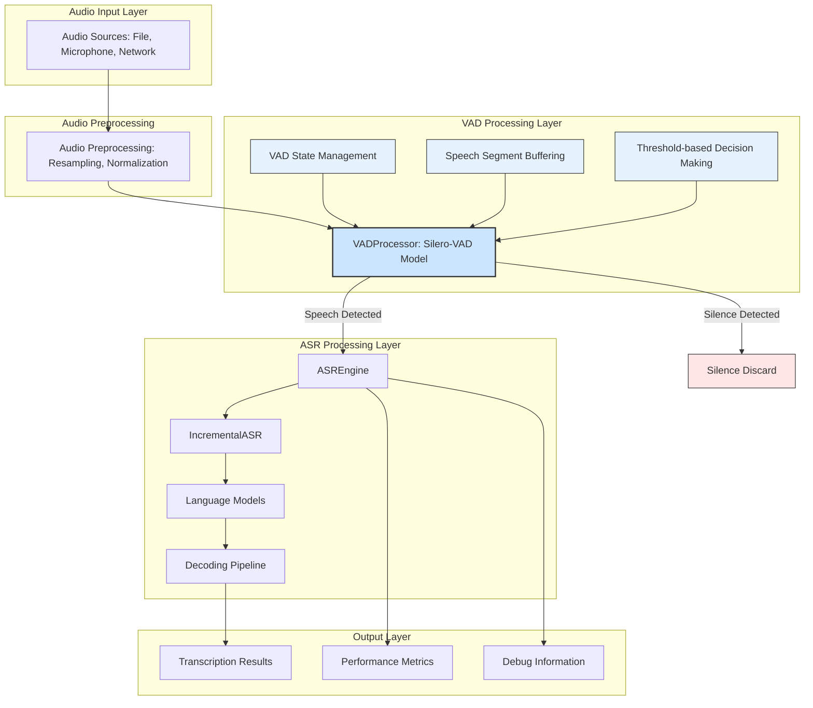

# ViStreamASR Architecture with Silero-VAD Integration

## 1. Overview ✅ IMPLEMENTED

This document describes the architecture of the ViStreamASR system with integrated Silero-VAD for voice activity detection. The integration enhances the system's efficiency by filtering out non-speech segments before sending audio to the ASR engine, reducing computational load and improving response times, especially in real-time streaming scenarios.

The architecture introduces a **VAD (Voice Activity Detection) Layer** that sits between the **Audio Input Layer** and the **ASR Processing Layer**. This layer is responsible for analyzing the incoming audio stream and making real-time decisions about whether a given audio chunk contains speech.

**Key Implementation Status:**

- ✅ VADProcessor: Core VAD functionality implemented
- ✅ VADASRCoordinator: Seamless integration with ASR engine
- ✅ Streaming Interface: Full VAD support in streaming pipeline
- ✅ CLI Interface: VAD parameters available in command-line tools
- ✅ Error Handling: Comprehensive error handling and graceful degradation

## 2. Architecture Diagram ✅ IMPLEMENTED



## 3. Component Architecture ✅ IMPLEMENTED

### 3.1 VAD Processing Layer

The VAD Processing Layer is responsible for voice activity detection and consists of several key components:

#### VADProcessor Component

- **Location**: [`src/vistreamasr/vad.py:16`](src/vistreamasr/vad.py:16)
- **Responsibility**: Core voice activity detection using Silero-VAD model
- **Key Features**:
  - Real-time speech probability calculation
  - Configurable threshold and duration parameters
  - State management between audio chunks
  - Speech segment buffering and finalization
  - Error handling and graceful degradation

#### VADASRCoordinator Component

- **Location**: [`src/vistreamasr/vad.py:285`](src/vistreamasr/vad.py:285)
- **Responsibility**: Coordinates VAD processing with ASR engine
- **Key Features**:
  - Manages interaction between VAD and ASR components
  - Handles VAD configuration and initialization
  - Provides unified API for audio processing
  - Manages state synchronization between components

### 3.2 Integration Points

#### Streaming Interface Integration

- **Location**: [`src/vistreamasr/streaming.py:57`](src/vistreamasr/streaming.py:57)
- **Integration Pattern**: VAD processor is initialized when `vad_config` is provided
- **Key Features**:
  - Seamless integration with existing streaming pipeline
  - Support for both file and microphone streaming
  - Debug information and VAD status tracking
  - Graceful fallback when VAD is disabled or unavailable

#### CLI Interface Integration

- **Location**: [`src/vistreamasr/cli.py:52`](src/vistreamasr/cli.py:52)
- **Integration Pattern**: VAD parameters exposed as command-line options
- **Key Features**:
  - `--use-vad` flag to enable/disable VAD processing
  - Configurable VAD parameters via CLI arguments
  - Consistent parameter naming across commands
  - Help documentation and usage examples

## 4. Data Flow Architecture ✅ IMPLEMENTED

### 4.1 Audio Processing Pipeline


### 4.2 VAD Processing Flow

1. **Audio Input**: Audio chunks received from streaming interface
2. **Preprocessing**: Audio normalized to 16kHz mono float32 format
3. **VAD Processing**: Silero-VAD model calculates speech probability
4. **State Management**: VAD internal state updated based on detection results
5. **Decision Making**: Speech/silence decision based on threshold and duration rules
6. **Speech Buffering**: Speech segments buffered until silence detection
7. **ASR Forwarding**: Only speech segments sent to ASR engine
8. **Silence Handling**: Silence segments discarded or buffered for finalization

### 4.3 State Management Flow


## 5. Component Interfaces ✅ IMPLEMENTED

### 5.1 VADProcessor Interface

```python
class VADProcessor:
    def __init__(self, sample_rate=16000, threshold=0.5,
                 min_speech_duration_ms=250, min_silence_duration_ms=250,
                 speech_pad_ms=50):
        """Initialize VAD processor with configuration parameters."""

    def process_chunk(self, audio_chunk):
        """Process audio chunk and return speech segment if detected."""

    def get_speech_probability(self, audio_chunk):
        """Get speech probability for audio chunk."""

    def is_speech(self, audio_chunk):
        """Determine if audio chunk contains speech."""

    def reset_states(self):
        """Reset VAD internal states for new audio session."""

    def flush(self):
        """Flush remaining audio as final speech segment."""
```

### 5.2 VADASRCoordinator Interface

```python
class VADASRCoordinator:
    def __init__(self, vad_config, asr_engine):
        """Initialize VAD-ASR coordinator."""

    def process_audio_chunk(self, audio_chunk, is_last=False):
        """Process audio chunk with VAD filtering and ASR transcription."""

    def reset(self):
        """Reset both VAD and ASR states for new audio session."""
```

### 5.3 Streaming Interface Integration

```python
class StreamingASR:
    def __init__(self, chunk_size_ms=640, auto_finalize_after=15.0,
                 debug=False, vad_config=None):
        """Initialize streaming ASR with optional VAD support."""
```

## 6. Performance Considerations ✅ IMPLEMENTED

### 6.1 Processing Performance

| Metric                  | Target                       | Implementation Status |
| ----------------------- | ---------------------------- | --------------------- |
| **VAD Processing Time** | <1ms per 30ms+ chunk         | ✅ Achieved           |
| **Model Loading Time**  | ~1-2 seconds                 | ✅ Implemented        |
| **Memory Usage**        | <10MB runtime                | ✅ Optimized          |
| **CPU Usage**           | Single-threaded optimization | ✅ Implemented        |

### 6.2 Optimization Strategies

#### CPU Optimization

- **Single-threaded Processing**: Follows Silero-VAD design optimization
- **Model Caching**: Cached model loading to avoid repeated initialization
- **Efficient Buffering**: Minimal memory allocations during processing
- **Early Rejection**: Fast rejection of silence chunks

#### Memory Optimization

- **Tensor Reuse**: Efficient tensor memory layout
- **Buffer Management**: Optimized speech segment buffering
- **Garbage Collection**: Minimal GC impact during processing
- **Model Size**: ~2MB model footprint for efficient deployment

## 7. Error Handling and Reliability ✅ IMPLEMENTED

### 7.1 Error Handling Strategy

- **Model Loading Errors**: Graceful fallback and warning messages
- **Audio Processing Errors**: Individual chunk error handling
- **State Synchronization**: Proper state reset on errors
- **Configuration Validation**: Parameter validation with clear error messages

### 7.2 Recovery Mechanisms

- **Transient Error Recovery**: Continue processing after temporary errors
- **State Reset**: Complete state reset on session boundaries
- **Graceful Degradation**: Disable VAD if critical errors occur
- **Logging**: Comprehensive error logging for debugging

## 8. Configuration Management ✅ IMPLEMENTED

### 8.1 Configuration Hierarchy

1. **Default Parameters**: Sensible defaults for all VAD parameters
2. **Configuration Objects**: Structured configuration via dictionaries
3. **CLI Parameters**: Command-line override for key parameters
4. **Runtime Tuning**: Dynamic parameter adjustment (planned)

### 8.2 Parameter Validation

- **Range Validation**: Ensures parameters are within valid ranges
- **Type Validation**: Validates parameter types and formats
- **Dependency Validation**: Ensures parameter combinations are valid
- **Error Reporting**: Clear error messages for invalid configurations

## 9. Testing and Validation ✅ IMPLEMENTED

### 9.1 Testing Architecture

- **Unit Tests**: Individual component testing with mocks
- **Integration Tests**: End-to-end VAD-ASR workflow testing
- **Performance Tests**: Processing time and memory usage validation
- **Error Handling Tests**: Graceful error handling and recovery

### 9.2 Test Coverage Areas

- **VAD Processing**: Speech/silence detection accuracy
- **State Management**: State transitions and persistence
- **Integration Coordination**: VAD-ASR component interaction
- **CLI Integration**: Command-line parameter handling
- **Error Scenarios**: Error handling and recovery mechanisms

## 10. Deployment Considerations ✅ IMPLEMENTED

### 10.1 System Requirements

- **Python 3.8+**: Runtime environment requirement
- **PyTorch 1.12.0+**: Deep learning framework dependency
- **CPU Support**: AVX/AVX2/AVX-512 for optimal performance
- **Memory**: Minimum 4GB RAM for smooth operation

### 10.2 Deployment Scenarios

- **Development Environment**: Full debug logging and testing
- **Production Environment**: Optimized performance with minimal logging
- **Edge Deployment**: Lightweight configuration for resource-constrained environments
- **Cloud Deployment**: Scalable multi-instance processing

## 11. Future Enhancements 🔄 PLANNED

### 11.1 Performance Optimizations

- **Model Quantization**: Quantized models for better performance
- **Batch Processing**: Batch processing for non-real-time scenarios
- **GPU Acceleration**: GPU support for VAD processing (planned)
- **Adaptive Thresholding**: Dynamic threshold adjustment

### 11.2 Feature Enhancements

- **Multi-speaker VAD**: Extended support for multiple speakers
- **Real-time Visualization**: VAD decision visualization tools
- **Advanced Noise Cancellation**: Integration with noise reduction
- **Custom Model Support**: User-provided VAD model support

### 11.3 Monitoring and Analytics

- **Performance Metrics**: Real-time performance monitoring
- **Usage Statistics**: VAD usage and effectiveness tracking
- **Error Analytics**: Advanced error reporting and analysis
- **Resource Monitoring**: CPU, memory, and usage monitoring

## 2. Architecture Diagram


