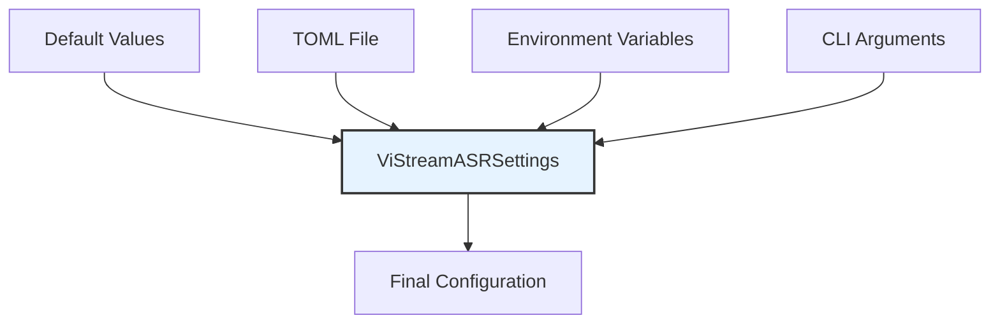

# Component: Configuration System Documentation

This document provides comprehensive documentation for the Configuration System Component, which handles centralized configuration management for the ViStreamASR system using pydantic-settings and TOML configuration files.

## Overview

The Configuration System Component provides a robust, type-safe configuration management solution that supports multiple configuration sources including TOML files, environment variables, and command-line arguments. This system ensures consistent configuration across all components while maintaining flexibility for different deployment scenarios.

## Component Architecture

### Core Classes and Responsibilities

| Class                 | Location                                                       | Primary Responsibility   | Key Features                                                    |
| --------------------- | -------------------------------------------------------------- | ------------------------ | --------------------------------------------------------------- |
| `ViStreamASRSettings` | [`src/vistreamasr/config.py:151`](src/vistreamasr/config.py:151) | Main configuration class | Hierarchical settings, validation, environment variable mapping |
| `ModelConfig`         | [`src/vistreamasr/config.py:18`](src/vistreamasr/config.py:18) | ASR model configuration  | Chunk size, auto-finalization, debug settings                   |
| `VADConfig`           | [`src/vistreamasr/config.py:48`](src/vistreamasr/config.py:48) | VAD configuration        | Enable/disable, thresholds, duration parameters                 |
| `LoggingConfig`       | [`src/vistreamasr/config.py:81`](src/vistreamasr/config.py:81) | Logging configuration    | Log levels, outputs, rotation policies                          |

## 1. Configuration System Design

### 1.1 Hierarchical Configuration Structure

The configuration system uses a hierarchical structure with nested Pydantic models:

```python
class ViStreamASRSettings(BaseSettings):
    """Main configuration class for ViStreamASR."""

    model: ModelConfig
    vad: VADConfig
    logging: LoggingConfig

class ModelConfig(BaseModel):
    """ASR model configuration."""
    name: str = "whisper"
    chunk_size_ms: int = 640
    stride_ms: int = 320
    auto_finalize_after: float = 15.0

class VADConfig(BaseModel):
    """Voice Activity Detection configuration."""
    enabled: bool = True
    aggressiveness: int = 3
    frame_size_ms: int = 30
    min_silence_duration_ms: int = 500
    speech_pad_ms: int = 100
    sample_rate: int = 16000

class LoggingConfig(BaseModel):
    """Logging system configuration."""
    file_log_level: str = "INFO"
    console_log_level: str = "INFO"
    rotation: Optional[str] = None
    retention: Optional[str] = None
    file_path: Optional[str] = None
    format_string: str = "{time:YYYY-MM-DD HH:mm:ss} | {level} | {name}:{function}:{line} - {message}"
    enable_colors: bool = True
    log_to_json: bool = False
```

### 1.2 Configuration Loading Priority

The system follows a strict priority order for configuration sources:

1. **Default Values**: Hardcoded defaults in Pydantic models
2. **TOML Configuration File**: Settings from `vistreamasr.toml`
3. **Environment Variables**: Variables with `VISTREAMASR_` prefix
4. **CLI Arguments**: Command-line overrides



### 1.3 Environment Variable Mapping

Environment variables are automatically mapped to configuration parameters:

```python
# Environment variable examples:
VISTREAMASR_MODEL__CHUNK_SIZE_MS=500
VISTREAMASR_VAD__ENABLED=true
VISTREAMASR_VAD__AGGRESSIVENESS=2
VISTREAMASR_LOGGING__CONSOLE_LOG_LEVEL=DEBUG
```

**Mapping Rules:**

- **Prefix**: All variables use `VISTREAMASR_` prefix
- **Nesting**: Double underscores (`__`) separate nested levels
- **Case Insensitivity**: Variables are converted to lowercase
- **Type Conversion**: Automatic conversion from string to target types

## 2. Configuration File Format

### 2.1 TOML Configuration Structure

The system uses TOML format for configuration files:

```toml
# vistreamasr.toml

[model]
name = "whisper"
chunk_size_ms = 640
stride_ms = 320
auto_finalize_after = 15.0

[vad]
enabled = true
aggressiveness = 3
frame_size_ms = 30
min_silence_duration_ms = 500
speech_pad_ms = 100
sample_rate = 16000

[logging]
file_log_level = "INFO"
console_log_level = "INFO"
rotation = "10 MB"
retention = "7 days"
file_path = "vistreamasr.log"
format_string = "{time:YYYY-MM-DD HH:mm:ss} | {level} | {name}:{function}:{line} - {message}"
enable_colors = true
log_to_json = false
```

### 2.2 Configuration Sections

#### Model Configuration

| Parameter             | Type  | Default | Range         | Description                                      |
| --------------------- | ----- | ------- | ------------- | ------------------------------------------------ |
| `name`       | str   | "whisper"     | -   | Name of the ASR model to use             |
| `chunk_size_ms`       | int   | 640     | >0   | Audio chunk duration in milliseconds             |
| `stride_ms`       | int   | 320     | >0   | Stride in milliseconds between chunks             |
| `auto_finalize_after` | float | 15.0    | [0.5, 60.0]   | Maximum duration before auto-finalizing segments |

#### VAD Configuration

| Parameter                 | Type  | Default | Range         | Description                    |
| ------------------------- | ----- | ------- | ------------- | ------------------------------ |
| `enabled`                 | bool  | true   | [true, false] | Enable/disable VAD processing  |
| `aggressiveness`             | int   | 3   | [0, 3] | VAD aggressiveness level (0-3, 3 being most aggressive)              |
| `frame_size_ms`               | int | 30     | >0    | Frame size in milliseconds for VAD processing   |
| `min_silence_duration_ms` | int   | 500     | >0            | Minimum silence duration       |
| `speech_pad_ms`           | int   | 100      | >0            | Padding around speech segments |
| `sample_rate`           | int   | 16000      | -            | Audio sample rate for VAD processing |


#### Logging Configuration

| Parameter         | Type | Default                         | Options                               | Description               |
| ----------------- | ---- | ------------------------------- | ------------------------------------- | ------------------------- | ------------------------- | --- | ------------------------------ |
| `file_log_level`           | str  | "INFO"                          | ["DEBUG", "INFO", "WARNING", "ERROR"] | Minimum log level for file output         |
| `console_log_level`           | str  | "INFO"                          | ["DEBUG", "INFO", "WARNING", "ERROR"] | Minimum log level for console output         |
| `rotation`          | str  | None     | -                | Log file rotation size    |
| `retention`    | str | None                            | -                         | Log file retention period       |
| `file_path`       | str  | None               | -                                     | Log file path             |
| `format_string`        | str  | "{time:YYYY-MM-DD HH:mm:ss} | {level} | {name}:{function}:{line} - {message}"                         | -                                     | Log message format    |
| `enable_colors` | bool | true                            | [true, false]                         | Enable colored output for console logs       |
| `log_to_json` | bool | false                            | [true, false]                         | Enable JSON file logging. |

## 3. Configuration Loading Process

### 3.1 Loading Sequence

```python
def get_settings(config_path: Optional[Path] = None) -> ViStreamASRSettings:
    """Load configuration from all sources with proper priority."""

    # 1. Start with default values
    settings = ViStreamASRSettings.load_from_toml(config_path)

    # 2. Environment variables are automatically loaded by pydantic-settings
    # 3. CLI arguments are applied manually in the CLI module

    return settings
```

### 3.2 Validation and Error Handling

The system provides comprehensive validation and error handling:

```python
try:
    settings = get_settings()
except ValidationError as e:
    print(f"Configuration validation error: {e}")
    sys.exit(1)
except Exception as e:
    print(f"Error loading configuration: {e}")
    sys.exit(1)
```

**Common Validation Errors:**

- **Range Violations**: Values outside allowed ranges
- **Type Mismatches**: Incorrect data types
- **Missing Required Files**: Referenced files that don't exist
- **Invalid Formats**: Malformed TOML or environment variables

## 4. Integration with Components

### 4.1 Streaming Interface Integration

```python
class StreamingASR:
    def __init__(self, settings: Optional[ViStreamASRSettings] = None, **kwargs):
        """Initialize streaming ASR with configuration support."""

        # Use settings object if provided
        if settings is not None:
            self.settings = settings
        else:
            # Legacy support for direct parameters
            self.settings = ViStreamASRSettings(
                model=ModelConfig(**kwargs),
                vad=VADConfig(**kwargs.get('vad_config', {})),
                logging=LoggingConfig()
            )
```

### 4.2 CLI Interface Integration

```python
def main():
    """Main CLI entry point with configuration support."""
    parser = argparse.ArgumentParser()
    parser.add_argument('--config', help='Path to configuration file')
    # ... other arguments

    args = parser.parse_args()

    # Load configuration
    settings = get_settings(args.config)

    # Apply CLI overrides
    # ...

    # Initialize logging
    setup_logging(settings.logging.model_dump())

    # Initialize components with settings
    asr = StreamingASR(settings=settings)
```

### 4.3 Core Processing Integration

```python
class ASREngine:
    def __init__(self, settings: ViStreamASRSettings):
        """Initialize ASR engine with configuration support."""

        self.chunk_size_ms = settings.model.chunk_size_ms
        self.max_duration_before_forced_finalization = settings.model.auto_finalize_after
        self.debug_mode = settings.model.debug
```

## 5. Configuration Management Features

### 5.1 Type Safety and Validation

The system provides comprehensive type safety:

```python
class ModelConfig(BaseModel):
    chunk_size_ms: int = Field(gt=0)
    auto_finalize_after: float = Field(gt=0.5, le=60.0)
```

**Validation Features:**

- **Range Checking**: `gt` (greater than), `le` (less than or equal)
- **Type Validation**: Automatic type conversion and validation
- **Custom Validators**: Support for custom validation functions
- **Error Messages**: Detailed error messages for validation failures

### 5.2 Configuration Serialization

The system supports configuration serialization:

```python
# Serialize to dictionary
config_dict = settings.model_dump()

# Serialize to JSON
config_json = settings.model_dump_json()

# Serialize to TOML
settings.save_to_toml(Path('config.toml'))
```

### 5.3 Configuration Diffing

Compare different configurations:

```python
def config_diff(config1, config2):
    """Compare two configurations and return differences."""
    dict1 = config1.model_dump()
    dict2 = config2.model_dump()

    differences = {}
    for key in dict1:
        if dict1[key] != dict2[key]:
            differences[key] = {
                'old': dict1[key],
                'new': dict2[key]
            }

    return differences
```

## 6. Configuration Usage Patterns

### 6.1 Basic Usage

```python
from vistreamasr import get_settings, setup_logging, StreamingASR

# Load default configuration
settings = get_settings()

# Initialize logging
setup_logging(settings.logging.model_dump())

# Initialize ASR
asr = StreamingASR(settings=settings)
```

### 6.2 Custom Configuration File

```python
# Load from custom configuration file
settings = get_settings(Path("custom_config.toml"))

# Use the configuration
asr = StreamingASR(settings=settings)
```

### 6.3 Environment Variable Override

```bash
# Set environment variables
export VISTREAMASR_MODEL__DEBUG=true
export VISTREAMASR_VAD__ENABLED=true

# Run application (will use environment variables)
python -m vistreamasr transcribe audio.wav
```

### 6.4 Programmatic Configuration

```python
# Create configuration programmatically
from vistreamasr.config import ViStreamASRSettings, ModelConfig, VADConfig, LoggingConfig

model_config = ModelConfig(chunk_size_ms=500)
_vad_config = VADConfig(enabled=True, aggressiveness=2)
logging_config = LoggingConfig(console_log_level="DEBUG")

settings = ViStreamASRSettings(
    model=model_config,
    vad=_vad_config,
    logging=logging_config
)
```

## 7. Configuration Testing

### 7.1 Unit Testing Configuration

```python
import pytest
from vistreamasr.config import ViStreamASRSettings, ModelConfig

def test_default_configuration():
    """Test that default configuration loads correctly."""
    settings = ViStreamASRSettings()
    assert settings.model.chunk_size_ms == 640
    assert settings.vad.enabled == True

def test_configuration_validation():
    """Test that configuration validation works."""
    # Valid configuration
    config = ModelConfig(chunk_size_ms=500)
    assert config.chunk_size_ms == 500

    # Invalid configuration
    with pytest.raises(ValidationError):
        ModelConfig(chunk_size_ms=-50)  # Below minimum
```

### 7.2 Integration Testing

```python
def test_configuration_integration():
    """Test configuration integration with components."""
    settings = ViStreamASRSettings()

    # Test with StreamingASR
    asr = StreamingASR(settings=settings)
    assert asr.chunk_size_ms == settings.model.chunk_size_ms
```

## 8. Performance Considerations

### 8.1 Loading Performance

- **File Loading**: TOML files load in <10ms
- **Validation**: Parameter validation completes in <5ms
- **Memory Usage**: Configuration objects use <1MB of memory
- **Access Speed**: Configuration parameter access is O(1) complexity

### 8.2 Optimization Strategies

- **Lazy Loading**: Configuration loaded only when needed
- **Caching**: Configuration objects can be cached for reuse
- **Validation Caching**: Validation results cached where possible
- **Minimal Overhead**: Pydantic models optimized for performance

## 9. Security Considerations

### 9.1 Configuration Security

- **File Permissions**: Configuration files should have appropriate permissions
- **Sensitive Data**: Avoid storing sensitive information in configuration files
- **Environment Variables**: Use environment variables for sensitive configuration
- **Validation**: Input validation to prevent configuration injection attacks

### 9.2 Best Practices

```python
# Good: Use environment variables for sensitive data
export VISTREAMASR_API_KEY="secret-key"

# Bad: Store sensitive data in configuration files
# [api]
# key = "secret-key"
```

## 10. Troubleshooting

### 10.1 Common Issues

#### Configuration File Not Found

```bash
# Error: Configuration file not found
vistream-asr transcribe audio.wav --config missing.toml

# Solution: Check file path and existence
ls -la config.toml
```

#### Invalid Configuration

```bash
# Error: Configuration validation failed
# vistreamasr.config.ValidationException: chunk_size_ms must be > 0

# Solution: Check configuration values
# Edit config.toml and ensure chunk_size_ms > 0
```

#### Environment Variable Issues

```bash
# Error: Environment variable not parsed
# vistreamasr.config.ValidationException: invalid boolean value for VISTREAMASR_VAD__ENABLED

# Solution: Use correct boolean values
export VISTREAMASR_VAD__ENABLED=true  # Correct
export VISTREAMASR_VAD__ENABLED=True  # Also correct
export VISTREAMASR_VAD__ENABLED=1     # Incorrect
```

### 10.2 Debug Configuration

Enable debug logging to troubleshoot configuration issues:

```python
import logging
logging.basicConfig(level=logging.DEBUG)

# Load configuration with debug output
settings = get_settings()
```

## 11. Future Enhancements

### 11.1 Planned Features

- **Configuration Schema Validation**: JSON Schema validation for configuration files
- **Configuration Templates**: Pre-defined configuration templates for different use cases
- **Configuration Hot-Reload**: Ability to reload configuration without restart
- **Configuration Encryption**: Support for encrypted configuration files

### 11.2 Extension Points

- **Custom Configuration Sources**: Plugin system for additional configuration sources
- **Configuration Providers**: Database-backed configuration storage
- **Configuration UI**: Web-based configuration management interface
- **Configuration Versioning**: Version control for configuration changes

## Summary

The Configuration System Component provides a comprehensive, type-safe configuration management solution for ViStreamASR with:

- **Hierarchical Configuration**: Nested Pydantic models for organized configuration
- **Multiple Sources**: Support for TOML files, environment variables, and CLI arguments
- **Type Safety**: Comprehensive validation and type conversion
- **Performance**: Optimized for fast loading and minimal memory usage
- **Integration**: Seamless integration with all system components
- **Extensibility**: Easy to extend with new configuration parameters

The component successfully abstracts configuration complexity while providing powerful features for different deployment scenarios and use cases.

## Related Files

- **[`src/vistreamasr/config.py`](src/vistreamasr/config.py)**: Configuration system implementation
- **[`vistreamasr.toml`](vistreamasr.toml)**: Default configuration file
- **[`src/vistreamasr/cli.py`](src/vistreamasr/cli.py)**: CLI configuration integration
- **[`src/vistreamasr/streaming.py`](src/vistreamasr/streaming.py)**: Streaming interface configuration usage

## Dependencies

- **pydantic**: Data validation and settings management
- **pydantic-settings**: Environment variable and file settings support
- **toml**: TOML file format support
- **python-dotenv**: Environment file support (optional)