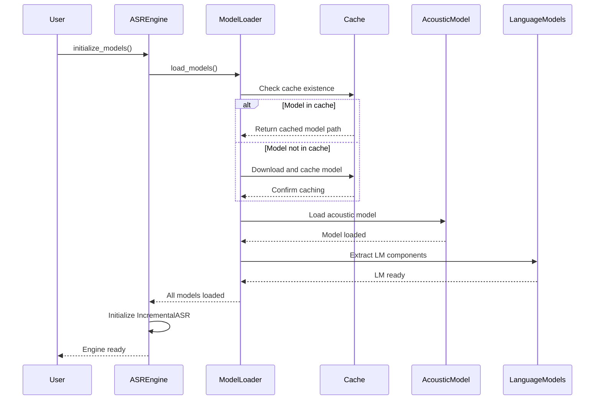
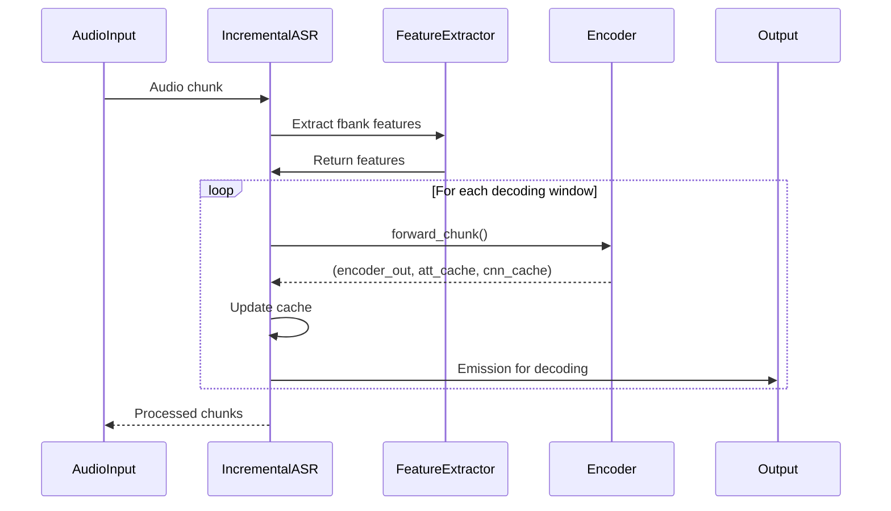
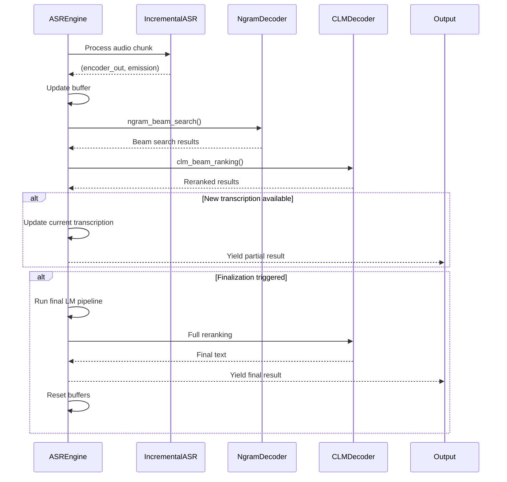

# Component: Core Processing Documentation

This document provides comprehensive documentation for the Core Processing Component, which handles the fundamental ASR engine functionality including model management, audio processing, and decoding mechanics.

## Overview

The Core Processing Component is the heart of the ViStreamASR system, responsible for:
- ASR engine initialization and model management
- Audio processing pipeline and feature extraction
- Incremental speech recognition and decoding
- Language model integration and beam search

## Component Architecture

### Core Classes and Responsibilities

| Class | Location | Primary Responsibility | Key Methods |
|-------|----------|----------------------|-------------|
| `ASREngine` | [`src/core.py:432`](src/core.py:432) | Core ASR logic management | `initialize_models()`, `process_audio_chunk()`, `reset_state()` |
| `IncrementalASR` | [`src/core.py:346`](src/core.py:346) | Incremental audio processing | `forward()`, `reset_cache()` |
| `Model Loading Functions` | [`src/core.py:108`](src/core.py:108) | Model download and caching | `load_models()`, `get_cache_dir()` |
| `Decoding Functions` | [`src/core.py:277`](src/core.py:277) | Language model decoding | `ngram_beam_search()`, `clm_beam_ranking()` |

## 1. ASR Engine Initialization

### Model Loading Process

The ASR engine follows a sophisticated model loading strategy that ensures efficient caching and automatic downloads:

```python
def load_models(debug_mode=False):
    """Load models with automatic download and caching to ~/.cache/ViStreamASR."""
    
    # Use cache directory
    cache_dir = get_cache_dir()
    model_path = cache_dir / "pytorch_model.bin"
    
    # Check if model exists in cache, if not download it
    if not model_path.exists():
        # Download the model with progress indication
        response = requests.get(model_url, stream=True)
        # ... download logic with progress tracking
```

**Key Features:**
- **Automatic Caching**: Models are cached in `~/.cache/ViStreamASR/model/` to avoid repeated downloads
- **Progress Tracking**: Real-time download progress display
- **Error Handling**: Comprehensive exception handling for network and file operations
- **Temporary File Management**: Models extracted to temporary files for safe loading

### Model Components

The system loads three key model components:

1. **Acoustic Model** (lines [`164-178`](src/core.py:164-178)):
   - Extracted from `model/acoustic/model.pt` in the tarball
   - Loaded using `torch.jit.load()` with GPU/CPU device selection
   - Implements the U2 streaming architecture

2. **Language Model Components** (lines [`193-230`](src/core.py:193-230)):
   - **Lexicon**: `model/lm/lexicon.txt` - Character-to-phoneme mappings
   - **Tokens**: `model/lm/tokens.txt` - Vocabulary tokens
   - **N-gram LM**: `model/lm/vi_lm_5grams.bin` - 5-gram language model

3. **Decoders** (lines [`242-262`](src/core.py:242-262)):
   - **N-gram Beam Search Decoder**: For initial fast decoding
   - **Beam Search Decoder**: For simple beam search without language model

### Initialization Sequence



## 2. Audio Processing Pipeline

### Feature Extraction Pipeline

The audio processing pipeline converts raw audio into acoustic features suitable for the neural network:

```python
def compute_fbank(wav_path=None, waveform=None, sample_rate=16000, 
                  num_mel_bins=80, frame_length=25, frame_shift=10):
    """Extract fbank features."""
    if waveform is None:
        waveform, sample_rate = torchaudio.load(wav_path)
    waveform = waveform * (1 << 15)  # Scale to 16-bit range
    mat = kaldi.fbank(waveform,
                     num_mel_bins=num_mel_bins,
                     frame_length=frame_length,
                     frame_shift=frame_shift,
                     sample_frequency=sample_rate)
    return mat
```

**Processing Steps:**
1. **Audio Loading** ([`src/core.py:98-99`](src/core.py:98-99)): Load audio with torchaudio
2. **Scaling** ([`src/core.py:100`](src/core.py:100)): Scale to 16-bit range (±32768)
3. **Feature Extraction** ([`src/core.py:101-106`](src/core.py:101-106)): Extract 80-dimensional filter bank features
4. **Frame Processing**: 25ms window with 10ms shift (100fps)

### Incremental Processing Architecture

The `IncrementalASR` class implements a sophisticated streaming architecture:

```python
class IncrementalASR():
    def __init__(self, model, device='cpu'):
        self.decoding_chunk_size = 16  # frames
        self.fbank_interval = 1600     # samples (100ms at 16kHz)
        self.fbank_future = 400        # samples (25ms lookahead)
        self.fbank_window = self.fbank_interval + self.fbank_future
        self.num_frame = 10
        self.subsampling = model.subsampling_rate()
        self.context = model.right_context() + 1
        self.stride = self.subsampling * self.decoding_chunk_size
        self.decoding_window = (self.decoding_chunk_size - 1) * self.subsampling + self.context
```

**Key Parameters:**
- **Decoding Chunk Size**: 16 frames (160ms at 100fps)
- **Future Context**: 25ms lookahead for better context
- **Subsampling Rate**: Model-specific downsampling factor
- **Right Context**: Model's right context window size

### Streaming Processing Flow



### Cache Management

The incremental processor maintains several caches for context preservation:

```python
def reset_cache(self):
    self.cache = {
        'offset': 0,
        'att_cache': torch.zeros((0, 0, 0, 0), device=self.device),
        'cnn_cache': torch.zeros((0, 0, 0, 0), device=self.device),
        'audio_remain': torch.tensor([], dtype=torch.float32, device=self.device),
        'fbank_features_remain': torch.tensor([], dtype=torch.float32, device=self.device),
    }
```

**Cache Components:**
- **Attention Cache**: Preserves attention state between chunks
- **CNN Cache**: Maintains convolutional layer states
- **Audio Remainder**: Handles incomplete audio chunks
- **Feature Remainder**: Manages partial feature sequences

## 3. Decoding Mechanics and Language Model Integration

### Two-Pass Decoding Strategy

The system employs a sophisticated two-pass decoding approach to balance speed and accuracy:

#### First Pass: N-gram Beam Search

```python
def ngram_beam_search(ngram_beam_search_decoder, emission):
    """Perform n-gram beam search decoding."""
    ngram_beam_search_result = ngram_beam_search_decoder(emission.cpu())
    decoder_output_tokens = []
    decoder_output_transcript = []
    decoder_ngram_best_transcipts = []
    
    for sample_output in ngram_beam_search_result:
        # Process beam search results
        for beam_output in sample_output:
            decoder_output_tokens[-1].append((beam_output.tokens[1:-1], beam_output.score))
            decoder_output_transcript[-1].append(' '.join(beam_output.words))
        decoder_ngram_best_transcipts.append(' '.join(sample_output[0].words))
    return decoder_ngram_best_transcipts, decoder_output_tokens, decoder_output_transcript
```

**Characteristics:**
- **Fast Initial Results**: Uses pre-computed 5-gram language model
- **Beam Size**: 100 beams for good coverage
- **LM Weight**: 0.5 for balanced language model influence
- **Log Add**: Enables proper probability combination

#### Second Pass: CTC Language Model Beam Ranking

```python
def clm_beam_ranking(model, encoder_out, decoder_output_tokens, decoder_output_transcript, reverse_weight=0.3):
    """Perform CTC Language Model beam ranking."""
    # Prepare hypotheses
    hyps = [y[0] for x in decoder_output_tokens for y in x]
    sample_num_hyps = [len(item) for item in decoder_output_tokens]
    
    # Pad sequences and add SOS/EOS tokens
    hyps_pad = pad_sequence(hyps, batch_first=True, padding_value=model.ignore_id)
    hyps_pad, _ = add_sos_eos(hyps_pad, model.sos, model.eos, model.ignore_id)
    
    # Run encoder with hypotheses
    encoder_out_repeat = []
    for i_encoder_out, num_hyps in zip(encoder_out, sample_num_hyps):
        encoder_out_repeat.append(i_encoder_out.unsqueeze(0).repeat(num_hyps, 1, 1))
    
    # Forward pass with bidirectional processing
    decoder_out, r_decoder_out, _ = model.decoder.forward(
        encoder_out_repeat, encoder_repeat_mask, hyps_pad, hyps_lens, r_hyps_pad, 
        reverse_weight=reverse_weight
    )
    
    # Calculate CLM scores and rerank
    clm_scores = []
    for i, hyp in enumerate(hyps):
        score = torch.gather(decoder_out[i, :len(hyps[i]), :], 1, hyps[i].unsqueeze(1)).sum()
        # Add reverse direction score if enabled
        if reverse_weight > 0:
            r_score = torch.gather(torch.flip(r_decoder_out[i, :len(hyps[i]), :], dims=[0]), 1, hyps[i].unsqueeze(1)).sum()
            score = score * (1 - reverse_weight) + r_score * reverse_weight
        clm_scores.append(score.detach().numpy().tolist())
```

**Advanced Features:**
- **Bidirectional Processing**: Uses both forward and backward encoder outputs
- **Reverse Weight**: 0.3 for balanced bidirectional influence
- **Hypothesis Scoring**: Detailed scoring of each hypothesis
- **Dynamic Reranking**: Reorders hypotheses based on language model scores

### Decoding Workflow



### Buffer Management and Finalization

The ASR engine implements sophisticated buffer management for optimal streaming performance:

```python
def _update_buffers(self, emission, encoder_out):
    """Update emission and encoder buffers."""
    if self.buffer_emission is None:
        self.buffer_emission = emission
        self.buffer_encode_out = encoder_out
    else:
        self.buffer_emission = torch.cat([self.buffer_emission, emission], 1)
        self.buffer_encode_out = torch.cat([self.buffer_encode_out, encoder_out], 1)

def _run_lm_pipeline(self, buffer_emission, buffer_encode_out):
    """Run full language model pipeline."""
    ngram_best, beam_tokens, beam_transcripts = ngram_beam_search(self.ngram_lm, buffer_emission)
    cls_best = clm_beam_ranking(self.acoustic_model, buffer_encode_out, beam_tokens, beam_transcripts)
    
    if len(cls_best) > 0 and len(cls_best[0]) > 0:
        return cls_best[0]
    return None
```

**Finalization Triggers:**
1. **Explicit Finalization**: When `is_last=True` is passed to `process_audio_chunk()`
2. **Forced Finalization**: After `max_chunks_before_forced_finalization` chunks (default: 23 chunks ≈ 15 seconds)
3. **Buffer Size Threshold**: When buffer contains sufficient audio for reliable decoding

## 4. Performance Optimization

### GPU Acceleration

The system automatically detects and utilizes GPU acceleration when available:

```python
# GPU configuration
use_gpu = torch.cuda.is_available()
device = 'cuda' if use_gpu else 'cpu'

# Model loading with GPU support
if use_gpu:
    model = model.cuda()
    if debug_mode:
        print(f"{symbols['rocket']} [ENGINE] Model loaded on GPU")
else:
    if debug_mode:
        print(f"{symbols['tool']} [ENGINE] Model loaded on CPU")
```

### Real-Time Factor (RTF) Monitoring

The engine tracks computational performance metrics:

```python
def get_asr_rtf(self):
    """Get the pure ASR processing RTF (computational performance only)."""
    if self.asr_audio_duration > 0:
        return self.asr_processing_time / self.asr_audio_duration
    return 0.0
```

**Performance Characteristics:**
- **Target RTF**: 0.3-0.4x (3-4x faster than real-time on CPU)
- **GPU Acceleration**: 2-5x improvement over CPU
- **Memory Usage**: ~5GB for model and processing buffers
- **Latency**: ~640ms with default chunk settings

### Debug and Monitoring

Comprehensive debugging capabilities for troubleshooting and optimization:

```python
def process_audio_chunk(self, audio_data, sample_rate, is_last=False):
    """Process a single audio chunk (core streaming logic)."""
    # Track audio duration for ASR timing
    chunk_duration = len(audio_data) / sample_rate
    asr_start_time = time.time()
    
    # Debug info at start of processing
    buffer_size = self.buffer_emission.size(1) if self.buffer_emission is not None else 0
    self.chunks_since_last_finalization += 1
    if self.debug_mode:
        print(f"{symbols['tool']} [CHUNK] Audio: {len(audio_data)} samples | Buffer: {buffer_size} frames | is_last: {is_last} | Chunks since finalization: {self.chunks_since_last_finalization}")
```

**Debug Information:**
- Chunk size validation and warnings
- Buffer size tracking
- Processing timing and RTF calculation
- Audio normalization monitoring
- Cache state inspection

## 5. Error Handling and Resilience

### Robust Audio Processing

The system includes comprehensive error handling for various audio scenarios:

```python
# Skip processing if chunk is too short
if len(audio_tensor) < 320:
    if self.debug_mode:
        print(f"{symbols['skip']}  [CHUNK] Skipping short chunk: {len(audio_tensor)} samples < 320")
    return {
        'current_transcription': self.current_transcription,
        'new_final_text': None
    }

# Handle chunk size mismatches
if actual_samples != expected_samples:
    if is_last and actual_samples < expected_samples:
        # Last chunk can be shorter - this is normal
        if self.debug_mode:
            print(f"{symbols['ruler']} [CHUNK-SIZE] Last chunk is shorter: {actual_samples}/{expected_samples} samples")
    elif actual_samples < expected_samples:
        # Non-last chunk is shorter than expected - potential issue
        if self.debug_mode:
            print(f"{symbols['warning']}  [CHUNK-SIZE] Chunk shorter than expected: {actual_samples}/{expected_samples} samples")
```

### Exception Handling

Graceful handling of various failure modes:

```python
try:
    encoder_out, emission = self.asr_realtime_model.forward(audio_tensor, last=False)
    # Process results
except Exception as e:
    if self.debug_mode:
        print(f"{symbols['warning']}  ASR processing error (chunk skipped): {e}")
    result['current_transcription'] = self.current_transcription
```

**Error Categories:**
1. **Model Loading Failures**: Network issues, corrupted downloads
2. **Audio Processing Errors**: Invalid audio formats, sample rate mismatches
3. **Memory Issues**: GPU out-of-memory, insufficient RAM
4. **Decoding Failures**: Language model errors, tokenization issues

## 6. Configuration and Customization

### Key Configuration Parameters

| Parameter | Default Value | Description | Impact |
|-----------|---------------|-------------|--------|
| `chunk_size_ms` | 640ms | Audio chunk duration | Latency vs accuracy trade-off |
| `max_duration_before_forced_finalization` | 15.0s | Maximum segment duration | Balances context vs responsiveness |
| `decoding_chunk_size` | 16 frames | Processing window size | Computational efficiency |
| `reverse_weight` | 0.3 | Bidirectional influence | Accuracy vs speed trade-off |
| `beam_size` | 100 (ngram), 16 (simple) | Beam search width | Accuracy vs computational cost |

### Customization Examples

```python
# Low-latency configuration (300ms chunks)
engine = ASREngine(chunk_size_ms=300, max_duration_before_forced_finalization=10.0)

# High-accuracy configuration (1000ms chunks with longer context)
engine = ASREngine(chunk_size_ms=1000, max_duration_before_forced_finalization=30.0)

# GPU-optimized configuration
engine = ASREngine(chunk_size_ms=640, debug_mode=True)  # Automatic GPU detection
```

## Summary

The Core Processing Component represents a sophisticated streaming ASR implementation with:

- **Efficient Model Management**: Automatic caching and progressive loading
- **Advanced Audio Processing**: Feature extraction with context preservation
- **Sophisticated Decoding**: Two-pass strategy combining speed and accuracy
- **Real-Time Performance**: Optimized for low-latency streaming applications
- **Robust Error Handling**: Comprehensive exception handling and recovery
- **Flexible Configuration**: Tunable parameters for different use cases

The component achieves real-time performance (0.3-0.4x RTF) on modern hardware while maintaining high accuracy through its incremental processing and language model integration strategies.