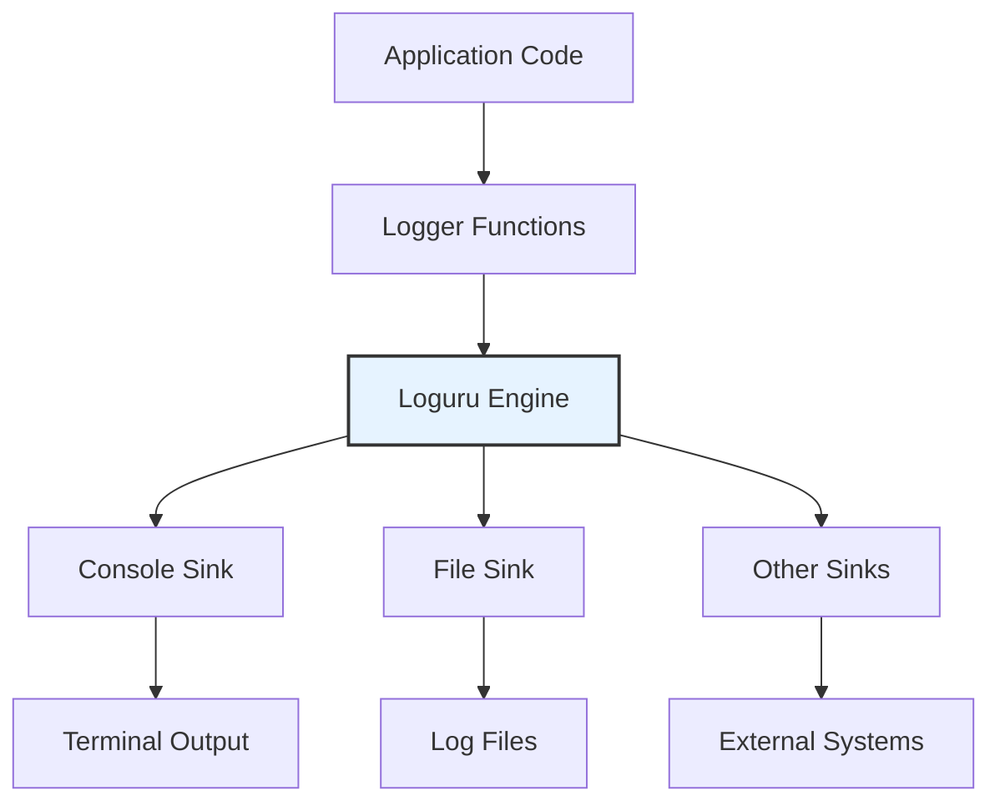

# Component: Logging System Documentation

This document provides comprehensive documentation for the Logging System Component, which handles structured logging throughout the ViStreamASR system using Loguru with support for multiple outputs, independent log levels for console and file, formatting options, and more.

## Overview

The Logging System Component provides a comprehensive logging solution that supports console output with color formatting, file output with rotation and retention policies, and symbol-based logging for maintaining compatibility with existing UI elements. A key feature is the ability to set different logging verbosity levels for console output and file output independently. The system is designed to be flexible, performant, and easy to integrate with all components of the ViStreamASR system.

## Component Architecture

### Core Functions and Classes

| Function/Class    | Location                                                           | Primary Responsibility    | Key Features                                                                    |
| ----------------- | ------------------------------------------------------------------ | ------------------------- | ------------------------------------------------------------------------------- |
| `setup_logging`   | [`src/vistreamasr/logging.py:60`](src/vistreamasr/logging.py:60)   | Initialize logging system | Multiple sinks, configuration-driven setup, independent console/file log levels |
| `get_logger`      | [`src/vistreamasr/logging.py:115`](src/vistreamasr/logging.py:115) | Get logger instance       | Module-specific loggers                                                         |
| `log_with_symbol` | [`src/vistreamasr/logging.py:158`](src/vistreamasr/logging.py:158) | Symbol-based logging      | UI-compatible output with symbols                                               |

## 1. Logging System Design

### 1.1 Architecture Overview

The logging system uses Loguru as the underlying logging library, providing a modern, feature-rich alternative to Python's standard logging module. The system supports multiple output sinks (console, file), structured formatting, and advanced features like log rotation and retention. Console and file sinks can now have independent log levels.



### 1.2 Logging Configuration

The logging system is configured through the `LoggingConfig` class, which now includes separate settings for console and file log levels:

```python
class LoggingConfig(BaseModel):
    """Configuration for logging system."""

    file_log_level: str = Field(
        default="INFO",
        description="Set the file logging level."
    )

    console_log_level: str = Field(
        default="INFO",
        description="Set the console logging level."
    )

    rotation: Optional[str] = Field(
        default=None,
        description="Log file rotation condition (e.g., '10 MB', '1 week')"
    )

    retention: Optional[str] = Field(
        default=None,
        description="Log file retention period (e.g., '1 week', '6 months')"
    )
    file_path: Optional[str] = Field(
        default=None,
        description="Path to log file. If None, logs to stdout only"
    )

    format_string: str = Field(
        default="{time:YYYY-MM-DD HH:mm:ss} | {level} | {name}:{function}:{line} - {message}",
        description="Format string for log messages"
    )

    enable_colors: bool = Field(
        default=True,
        description="Enable colored output for console logs"
    )
    log_to_json: bool = Field(
        default=False,
        description="Enable JSON file logging."
    )
```

### 1.3 Independent Console and File Log Levels

The system now allows setting different log levels for console output and file output. This is useful for scenarios where you might want verbose output to a log file for debugging while keeping the console output clean with only essential information (e.g., INFO or WARNING level).

#### Configuration

The `console_log_level` and `file_log_level` settings in the `LoggingConfig` class control this.

```python
logging_config = LoggingConfig(
    console_log_level="INFO",    # Console shows INFO and above
    file_log_level="DEBUG",      # File logs DEBUG and above
    file_path="vistreamasr.log"
)
```

#### Command-Line Interface (CLI) Arguments

These settings can also be controlled via CLI arguments:

```bash
# Set console log level to DEBUG and file log level to WARNING
vistreamasr transcribe audio.wav --logging.console-log-level DEBUG --logging.file-log-level WARNING

# Set only console log level
vistreamasr microphone --logging.console-log-level ERROR
```

**CLI Arguments:**

| Argument                      | Description                    | Default | Choices                                         |
| ----------------------------- | ------------------------------ | ------- | ----------------------------------------------- |
| `--logging.console-log-level` | Set the console logging level. | `INFO`  | `DEBUG`, `INFO`, `WARNING`, `ERROR`, `CRITICAL` |
| `--logging.file-log-level`    | Set the file logging level.    | `INFO`  | `DEBUG`, `INFO`, `WARNING`, `ERROR`, `CRITICAL` |

### 1.4 JSON File Logging

The system supports logging to JSON files, which is useful for structured logging and log aggregation. This feature can be enabled through the configuration. The `file_log_level` also applies to JSON file logging.

#### Configuration

```python
class LoggingConfig(BaseModel):
    """Logging system configuration."""
    # ... other fields ...
    log_to_json: bool = Field(
        default=False,
        description="Enable JSON file logging."
    )
```

#### Usage

When `log_to_json` is set to `True` in the configuration, a separate log file with a `.json.log` extension will be created alongside the standard log file. This file will contain log entries in JSON format, respecting the `file_log_level`.

```python
# In your configuration
logging_config = LoggingConfig(
    console_log_level="INFO",
    file_log_level="DEBUG",
    file_path="vistreamasr.log",
    log_to_json=True  # This will create vistreamasr.json.log
)

# In your application setup
setup_logging(settings.logging.model_dump())
```

### 1.5 Standard Library Logging Interception

The system can intercept and redirect standard library logging to Loguru, ensuring all logs from third-party libraries and the standard library are captured in a consistent format. The intercepted logs will be subject to the configured console and file log levels.

#### Configuration

The interception is automatic when `setup_logging` is called. No additional configuration is required.

#### Usage

```python
import logging
import sys
from vistreamasr.logging import setup_logging

# Set up logging
setup_logging(settings.logging.model_dump()) # settings dict with console_log_level and file_log_level

# Standard library logging will be automatically intercepted
logging.basicConfig(level=logging.INFO) # This level is effectively overridden by Loguru's sink levels
logging.info("This will be captured by Loguru")
```

### 1.6 Log Levels

The system supports standard Python logging levels for both console and file outputs:

| Level      | Value | Description                                           | Use Case                                     |
| ---------- | ----- | ----------------------------------------------------- | -------------------------------------------- |
| `DEBUG`    | 10    | Detailed diagnostic information                       | Development and troubleshooting              |
| `INFO`     | 20    | General information about program execution           | Normal operation tracking                    |
| `WARNING`  | 30    | Something unexpected happened, but not an error       | Potential issues that need attention         |
| `ERROR`    | 40    | Serious problem that prevented normal operation       | Errors that need immediate attention         |
| `CRITICAL` | 50    | Very serious error that may cause program termination | Critical failures requiring immediate action |

## 2. Core Logging Functions

### 2.1 setup_logging Function

The `setup_logging` function initializes the logging system based on configuration, now respecting separate console and file log levels:

```python
def setup_logging(settings: Dict[str, Any]) -> None:
    """
    Configure Loguru logging based on provided settings.

    Args:
        settings: Dictionary containing logging configuration, including
                  'console_log_level' and 'file_log_level'.
    """
    # ... implementation ...
```

**Parameters:**

- `settings`: Dictionary containing logging settings, including `console_log_level` and `file_log_level`.

**Features:**

- **Multiple Sinks**: Supports both console and file output simultaneously with independent levels.
- **Conditional Setup**: Only enables configured sinks.
- **Independent Log Levels**: `console_log_level` for console, `file_log_level` for file (and JSON file).
- **Automatic Rotation**: File rotation based on size or time.
- **Retention Management**: Automatic cleanup of old log files.
- **Compression**: Automatic compression of rotated logs.

### 2.2 get_logger Function

Provides module-specific logger instances:

```python
def get_logger(name: str) -> Logger:
    """Get a logger instance for a specific module."""
    return logger.bind(name=name)
```

**Usage Example:**

```python
# In module files
from vistreamasr.logging import get_logger

logger = get_logger(__name__)
logger.info("Module initialized")
```

### 2.3 log_with_symbol Function

Provides symbol-based logging for UI compatibility:

```python
def log_with_symbol(symbol: str, message: str, level: str = "info") -> None:
    """
    Log a message with a symbol prefix using appropriate log level.

    Args:
        symbol: Symbol to prefix the message (e.g., '🎤', '🔧')
        message: Message to log
        level: Log level ('debug', 'info', 'warning', 'error', 'critical')
    """
    # ... implementation ...
```

**Usage Example:**

```python
from vistreamasr.logging import log_with_symbol

log_with_symbol("Processing started", symbol="▶")
log_with_symbol("Processing completed", symbol="✅")
log_with_symbol("Warning: Low memory", symbol="⚠️", level="warning")
```

## 3. Log Formatting

### 3.1 Format Strings

The system supports customizable format strings with Loguru's formatting options. The `format_string` in `LoggingConfig` is used for file outputs, while a derived version (with colors) is typically used for the console.

#### Console Format (Default, derived from `format_string`)

```python
# The actual console format is generated by adding colors to the base format_string
# Base format_string: "{time:YYYY-MM-DD HH:mm:ss} | {level} | {name}:{function}:{line} - {message}"
# Effective console format (example): "<green>{time:YYYY-MM-DD HH:mm:ss}</green> | <level>{level: <8}</level> | <cyan>{name}</cyan>:<cyan>{function}</cyan>:<cyan>{line}</cyan> - <level>{message}</level>"
```

#### File Format (Default, from `format_string`)

```python
file_format = "{time:YYYY-MM-DD HH:mm:ss} | {level} | {name}:{function}:{line} - {message}"
```

### 3.2 Format Variables

| Variable          | Description      | Example               |
| ----------------- | ---------------- | --------------------- |
| `{time}`          | Timestamp        | `2024-08-02 14:32:15` |
| `{level}`         | Log level        | `INFO`                |
| `{name}`          | Logger name      | `vistreamasr.core`    |
| `{function}`      | Function name    | `initialize`          |
| `{line}`          | Line number      | `42`                  |
| `{message}`       | Log message      | `System initialized`  |

### 3.3 Color Formatting

The system supports ANSI color codes for console output:

| Color Code  | Description          |
| ----------- | -------------------- |
| `<green>`   | Green text           |
| `<level>`   | Level-specific color |

### 2.5 Exception Handling

The system provides a decorator to automatically catch and log exceptions that occur in functions, ensuring that all errors are properly logged according to the active log levels.

#### Configuration

The `@logger.catch` decorator from Loguru is used to wrap functions for exception handling.

#### Usage

```python
from loguru import logger

@logger.catch
def my_function():
    """This function will automatically log any uncaught exceptions."""
    # Function logic that might raise an exception
    risky_operation()
    return "Success"
```

## 4. File Management

### 4.1 Log Rotation

The system supports automatic log rotation based on file size or time for file sinks:

```python
# Size-based rotation
rotation = "10 MB"

# Time-based rotation
rotation = "1 day"
```

### 4.2 Log Retention

Automatic cleanup of old log files based on retention policies:

```python
# Time-based retention
retention = "7 days"

# Count-based retention
retention = 10
```

### 4.3 Log Compression

Automatic compression of rotated log files:

```python
# Enable compression
logger.add("app.log", compression="zip")
```

## 5. Integration Patterns

### 5.1 Module-Level Integration

```python
# In each module file
from vistreamasr.logging import get_logger, log_with_symbol

logger = get_logger(__name__)

class MyClass:
    def __init__(self):
        logger.info("MyClass initialized")
```

### 5.2 CLI Integration

```python
# In CLI module
from vistreamasr.logging import initialize_logging, log_with_symbol
from vistreamasr.config import get_settings

def main():
    # Initialize logging (loads from config/env/CLI)
    settings = initialize_logging()

    # Use logging throughout CLI
    log_with_symbol("ViStreamASR starting", symbol="🚀")
```

## 6. Advanced Features

### 6.1 Contextual Logging

Add context information to log messages:

```python
# Bind context to logger
logger = logger.bind(user_id="123", session_id="abc")
logger.info("User action performed")
```

### 6.2 Structured Logging

Log structured data for better analysis:

```python
# Log structured data
logger.bind(
    event="user_action",
    user_id="123",
    action="login",
).info("User logged in")
```

## 7. Configuration Examples

### 7.1 Development Configuration

```python
# High verbosity for development, console INFO, file DEBUG
dev_logging_config_dict = {
    "console_log_level": "INFO",
    "file_log_level": "DEBUG",
    "format_string": "{time:YYYY-MM-DD HH:mm:ss} | {level: <8} | {name}:{function}:{line} - {message}",
    "file_path": "vistreamasr_dev.log",
    "rotation": "1 MB",
    "retention": "3 days",
    "enable_colors": True
}
```

### 7.2 Production Configuration

```python
# Optimized for production, console WARNING, file INFO
prod_logging_config_dict = {
    "console_log_level": "WARNING", # Less verbose console
    "file_log_level": "INFO",       # Detailed file logs
    "file_path": "/var/log/vistreamasr/app.log",
    "rotation": "100 MB",
    "retention": "30 days",
    "format_string": "{time:YYYY-MM-DD HH:mm:ss} | {level} | {name}:{function}:{line} - {message}",
    "enable_colors": False # Typically no color in production logs
}
```

## 8. Testing and Debugging

### 8.1 Testing Logging

```python
import pytest
from vistreamasr.logging import setup_logging, get_logger

def test_logging_setup_levels():
    """Test that logging setup works correctly with different console/file levels."""
    settings_dict = {
        "logging": {
            "console_log_level": "DEBUG",
            "file_log_level": "ERROR",
            "file_path": "test_app.log",
            "format_string": "{time} | {level} | {message}"
        }
    }
    setup_logging(settings_dict)

    # ... test logging ...
```

## 9. Performance Considerations

### 9.1 Performance Impact

- **Memory Usage**: Minimal memory overhead (<1MB for typical usage)
- **CPU Impact**: Negligible impact on application performance
- **Disk I/O**: Configurable through rotation and retention policies

### 9.2 Optimization Strategies

- **Asynchronous Logging**: Use `enqueue=True` for non-blocking logging
- **Conditional Logging**: Use appropriate log levels to reduce output

```python
# Asynchronous logging example
logger.add("app.log", enqueue=True, backtrace=True)
```

## 10. Security Considerations

### 10.1 Log Security

- **Sensitive Data**: Avoid logging sensitive information (passwords, tokens)
- **File Permissions**: Ensure log files have appropriate permissions

## Summary

The Logging System Component provides a comprehensive, feature-rich logging solution for ViStreamASR with:

- **Multiple Outputs**: Support for console, file, and custom sinks.
- **Independent Log Levels**: Separate `console_log_level` and `file_log_level` for fine-grained control over output verbosity.
- **Flexible Configuration**: Highly configurable through `LoggingConfig` and CLI arguments.
- **Symbol-Based Logging**: UI-compatible output with symbols.
- **Advanced Features**: Rotation, retention, compression, structured JSON logging, and standard library interception.

## Related Files

- **[`src/vistreamasr/logging.py`](src/vistreamasr/logging.py)**: Logging system implementation, including `setup_logging`, `get_logger`, `log_with_symbol`.
- **[`src/vistreamasr/config.py`](src/vistreamasr/config.py)**: `LoggingConfig` class definition with `console_log_level` and `file_log_level`.
- **[`vistreamasr.toml`](vistreamasr.toml)**: Default logging configuration file, can specify `console_log_level` and `file_log_level`.
- **[`src/vistreamasr/cli.py`](src/vistreamasr/cli.py)**: CLI argument parsing for `--logging.console-log-level` and `--logging.file-log-level`, and integration with `initialize_logging`.

## Dependencies

- **loguru**: Modern logging library.