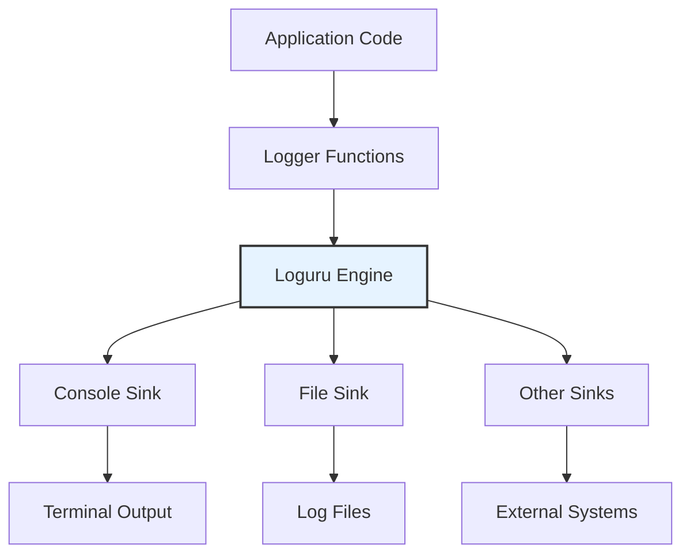

# Component: Logging System Documentation

This document provides comprehensive documentation for the Logging System Component, which handles structured logging throughout the ViStreamASR system using Loguru with support for multiple outputs, log levels, and formatting options.

## Overview

The Logging System Component provides a comprehensive logging solution that supports console output with color formatting, file output with rotation and retention policies, and symbol-based logging for maintaining compatibility with existing UI elements. The system is designed to be flexible, performant, and easy to integrate with all components of the ViStreamASR system.

## Component Architecture

### Core Functions and Classes

| Function/Class    | Location                                                         | Primary Responsibility    | Key Features                               |
| ----------------- | ---------------------------------------------------------------- | ------------------------- | ------------------------------------------ |
| `setup_logging`   | [`src/vistreamasr/logging.py:15`](src/vistreamasr/logging.py:15) | Initialize logging system | Multiple sinks, configuration-driven setup |
| `get_logger`      | [`src/vistreamasr/logging.py:45`](src/vistreamasr/logging.py:45) | Get logger instance       | Module-specific loggers                    |
| `log_with_symbol` | [`src/vistreamasr/logging.py:52`](src/vistreamasr/logging.py:52) | Symbol-based logging      | UI-compatible output with symbols          |
| `log_debug`       | [`src/vistreamasr/logging.py:67`](src/vistreamasr/logging.py:67) | Debug level logging       | Conditional debug output                   |
| `log_info`        | [`src/vistreamasr/logging.py:73`](src/vistreamasr/logging.py:73) | Info level logging        | Standard information output                |
| `log_warning`     | [`src/vistreamasr/logging.py:79`](src/vistreamasr/logging.py:79) | Warning level logging     | Warning condition output                   |
| `log_error`       | [`src/vistreamasr/logging.py:85`](src/vistreamasr/logging.py:85) | Error level logging       | Error condition output                     |
| `log_critical`    | [`src/vistreamasr/logging.py:91`](src/vistreamasr/logging.py:91) | Critical level logging    | Critical error output                      |

## 1. Logging System Design

### 1.1 Architecture Overview

The logging system uses Loguru as the underlying logging library, providing a modern, feature-rich alternative to Python's standard logging module. The system supports multiple output sinks (console, file), structured formatting, and advanced features like log rotation and retention.



### 1.2 Logging Configuration

The logging system is configured through the `LoggingConfig` class:

```python
class LoggingConfig(BaseModel):
    """Logging system configuration."""
    level: str = "INFO"
    format: str = "{time:YYYY-MM-DD HH:mm:ss} | {level} | {name} | {message}"
    file_enabled: bool = True
    file_path: str = "vistreamasr.log"
    rotation: str = "10 MB"
    retention: str = "7 days"
    console_enabled: bool = True
    console_format: str = "<green>{time:HH:mm:ss}</green> | <level>{level: <8}</level> | <cyan>{name}</cyan> | <level>{message}</level>"
```

### 1.3 Log Levels

The system supports standard Python logging levels:

| Level      | Value | Description                                           | Use Case                                     |
| ---------- | ----- | ----------------------------------------------------- | -------------------------------------------- |
| `DEBUG`    | 10    | Detailed diagnostic information                       | Development and troubleshooting              |
| `INFO`     | 20    | General information about program execution           | Normal operation tracking                    |
| `WARNING`  | 30    | Something unexpected happened, but not an error       | Potential issues that need attention         |
| `ERROR`    | 40    | Serious problem that prevented normal operation       | Errors that need immediate attention         |
| `CRITICAL` | 50    | Very serious error that may cause program termination | Critical failures requiring immediate action |

## 2. Core Logging Functions

### 2.1 setup_logging Function

The `setup_logging` function initializes the logging system based on configuration:

```python
def setup_logging(config: LoggingConfig):
    """Set up logging for ViStreamASR with the given configuration."""

    # Remove default Loguru handler
    logger.remove()

    # Add console sink if enabled
    if config.console_enabled:
        logger.add(
            sys.stderr,
            format=config.console_format,
            level=config.level,
            colorize=True
        )

    # Add file sink if enabled
    if config.file_enabled:
        logger.add(
            config.file_path,
            format=config.format,
            level=config.level,
            rotation=config.rotation,
            retention=config.retention,
            compression="zip"
        )
```

**Parameters:**

- `config`: `LoggingConfig` object with logging settings

**Features:**

- **Multiple Sinks**: Supports both console and file output simultaneously
- **Conditional Setup**: Only enables configured sinks
- **Automatic Rotation**: File rotation based on size or time
- **Retention Management**: Automatic cleanup of old log files
- **Compression**: Automatic compression of rotated logs

### 2.2 get_logger Function

Provides module-specific logger instances:

```python
def get_logger(name: str) -> Logger:
    """Get a logger instance for a specific module."""
    return logger.bind(name=name)
```

**Usage Example:**

```python
# In module files
from vistreamasr.logging import get_logger

logger = get_logger(__name__)
logger.info("Module initialized")
```

### 2.3 log_with_symbol Function

Provides symbol-based logging for UI compatibility:

```python
def log_with_symbol(message: str, symbol: str = "•", level: str = "INFO"):
    """Log a message with a symbol prefix for UI compatibility."""
    log_func = getattr(logger, level.lower(), logger.info)
    log_func(f"{symbol} {message}")
```

**Symbol Mapping:**

- `•` (bullet): Standard information
- `✓` (check): Success/completion
- `✗` (cross): Error/failure
- `⚠` (warning): Warning
- `ℹ` (info): Information
- `▶` (play): Action/progress
- `◼` (stop): Completion/stop

**Usage Example:**

```python
from vistreamasr.logging import log_with_symbol

log_with_symbol("Processing started", symbol="▶")
log_with_symbol("Processing completed", symbol="✓")
log_with_symbol("Warning: Low memory", symbol="⚠", level="WARNING")
```

### 2.4 Level-Specific Logging Functions

Convenience functions for different log levels:

```python
def log_debug(message: str, **kwargs):
    """Log a debug message."""
    logger.debug(message, **kwargs)

def log_info(message: str, **kwargs):
    """Log an info message."""
    logger.info(message, **kwargs)

def log_warning(message: str, **kwargs):
    """Log a warning message."""
    logger.warning(message, **kwargs)

def log_error(message: str, **kwargs):
    """Log an error message."""
    logger.error(message, **kwargs)

def log_critical(message: str, **kwargs):
    """Log a critical message."""
    logger.critical(message, **kwargs)
```

## 3. Log Formatting

### 3.1 Format Strings

The system supports customizable format strings with Loguru's formatting options:

#### Console Format (Default)

```python
console_format = "<green>{time:HH:mm:ss}</green> | <level>{level: <8}</level> | <cyan>{name}</cyan> | <level>{message}</level>"
```

**Output Example:**

```
14:32:15 | INFO     | vistreamasr.core | System initialized
14:32:16 | DEBUG    | vistreamasr.vad  | VAD processing started
```

#### File Format (Default)

```python
file_format = "{time:YYYY-MM-DD HH:mm:ss} | {level} | {name} | {message}"
```

**Output Example:**

```
2024-08-02 14:32:15 | INFO | vistreamasr.core | System initialized
2024-08-02 14:32:16 | DEBUG | vistreamasr.vad | VAD processing started
```

### 3.2 Format Variables

| Variable          | Description      | Example               |
| ----------------- | ---------------- | --------------------- |
| `{time}`          | Timestamp        | `2024-08-02 14:32:15` |
| `{time:HH:mm:ss}` | Formatted time   | `14:32:15`            |
| `{level}`         | Log level        | `INFO`                |
| `{level: <8}`     | Padded log level | `INFO     `           |
| `{name}`          | Logger name      | `vistreamasr.core`    |
| `{message}`       | Log message      | `System initialized`  |
| `{file}`          | File name        | `core.py`             |
| `{function}`      | Function name    | `initialize`          |
| `{line}`          | Line number      | `42`                  |
| `{thread}`        | Thread ID        | `12345`               |
| `{process}`       | Process ID       | `67890`               |

### 3.3 Color Formatting

The system supports ANSI color codes for console output:

| Color Code  | Description          |
| ----------- | -------------------- |
| `<green>`   | Green text           |
| `<blue>`    | Blue text            |
| `<red>`     | Red text             |
| `<yellow>`  | Yellow text          |
| `<cyan>`    | Cyan text            |
| `<magenta>` | Magenta text         |
| `<white>`   | White text           |
| `<level>`   | Level-specific color |

## 4. File Management

### 4.1 Log Rotation

The system supports automatic log rotation based on file size or time:

```python
# Size-based rotation
rotation = "10 MB"  # Rotate when file reaches 10MB
rotation = "500 KB" # Rotate when file reaches 500KB

# Time-based rotation
rotation = "1 day"    # Rotate daily
rotation = "1 week"   # Rotate weekly
rotation = "1 month"  # Rotate monthly
rotation = "1 hour"   # Rotate hourly

# Specific time rotation
rotation = "00:00"    # Rotate at midnight
rotation = "12:00"    # Rotate at noon
```

### 4.2 Log Retention

Automatic cleanup of old log files based on retention policies:

```python
# Time-based retention
retention = "7 days"   # Keep logs for 7 days
retention = "1 month"  # Keep logs for 1 month
retention = "1 year"   # Keep logs for 1 year

# Count-based retention
retention = 10         # Keep last 10 log files
retention = 30         # Keep last 30 log files
```

### 4.3 Log Compression

Automatic compression of rotated log files:

```python
# Enable compression
logger.add("app.log", compression="zip")

# Compression format options
compression = "zip"    # ZIP compression
compression = "gz"     # GZIP compression
compression = "bz2"    # BZIP2 compression
```

## 5. Integration Patterns

### 5.1 Module-Level Integration

```python
# In each module file
from vistreamasr.logging import get_logger, log_with_symbol

logger = get_logger(__name__)

class MyClass:
    def __init__(self):
        logger.info("MyClass initialized")

    def process_data(self, data):
        logger.debug(f"Processing data: {data}")
        log_with_symbol("Data processing started", symbol="▶")
        # ... processing logic ...
        log_with_symbol("Data processing completed", symbol="✓")
```

### 5.2 CLI Integration

```python
# In CLI module
from vistreamasr.logging import setup_logging, log_with_symbol

def main():
    # Initialize logging
    settings = load_configuration()
    setup_logging(settings.logging)

    # Use logging throughout CLI
    log_with_symbol("ViStreamASR starting", symbol="▶")
    try:
        # CLI logic
        log_with_symbol("Processing completed", symbol="✓")
    except Exception as e:
        log_with_symbol(f"Error: {e}", symbol="✗", level="ERROR")
        sys.exit(1)
```

### 5.3 Core Processing Integration

```python
# In core processing modules
from vistreamasr.logging import get_logger, log_debug, log_error

logger = get_logger(__name__)

class ASRProcessor:
    def process_audio(self, audio_data):
        try:
            log_debug(f"Processing audio chunk: {len(audio_data)} bytes")
            # Processing logic
            logger.info("Audio processing completed")
        except Exception as e:
            log_error(f"Audio processing failed: {e}")
            raise
```

## 6. Advanced Features

### 6.1 Contextual Logging

Add context information to log messages:

```python
# Bind context to logger
logger = logger.bind(user_id="123", session_id="abc")
logger.info("User action performed")
# Output: 2024-08-02 14:32:15 | INFO | vistreamasr.core | User action performed | user_id=123 | session_id=abc

# Use context in format strings
logger.add("app.log", format="{time} | {level} | {message} | {extra[user_id]}")
```

### 6.2 Structured Logging

Log structured data for better analysis:

```python
# Log structured data
logger.bind(
    event="user_action",
    user_id="123",
    action="login",
    ip_address="192.168.1.1"
).info("User logged in")

# Output: 2024-08-02 14:32:15 | INFO | vistreamasr.auth | User logged in | event=user_action | user_id=123 | action=login | ip_address=192.168.1.1
```

### 6.3 Performance Logging

Log performance metrics:

```python
import time
from vistreamasr.logging import logger

def process_data(data):
    start_time = time.time()

    # Processing logic
    result = expensive_operation(data)

    duration = time.time() - start_time
    logger.bind(
        operation="process_data",
        duration=duration,
        data_size=len(data)
    ).info("Processing completed")

    return result
```

### 6.4 Error Logging with Tracebacks

Log detailed error information:

```python
try:
    risky_operation()
except Exception as e:
    logger.opt(exception=True).error("Operation failed")
    # Output includes full traceback
```

## 7. Configuration Examples

### 7.1 Development Configuration

```python
# High verbosity for development
dev_logging_config = LoggingConfig(
    level="DEBUG",
    console_enabled=True,
    console_format="<green>{time:HH:mm:ss}</green> | <level>{level: <8}</level> | <cyan>{name}</cyan> | <level>{message}</level>",
    file_enabled=True,
    file_path="vistreamasr_dev.log",
    rotation="1 MB",
    retention="3 days"
)
```

### 7.2 Production Configuration

```python
# Optimized for production
prod_logging_config = LoggingConfig(
    level="INFO",
    console_enabled=False,  # No console output in production
    file_enabled=True,
    file_path="/var/log/vistreamasr/app.log",
    rotation="100 MB",
    retention="30 days",
    format="{time:YYYY-MM-DD HH:mm:ss} | {level} | {name} | {message}"
)
```

### 7.3 Debug Configuration

```python
# Maximum verbosity for debugging
debug_logging_config = LoggingConfig(
    level="DEBUG",
    console_enabled=True,
    console_format="<green>{time:HH:mm:ss.SSS}</green> | <level>{level: <8}</level> | <cyan>{name}</cyan> | <cyan>{file}</cyan>:<cyan>{line}</cyan> | <level>{message}</level>",
    file_enabled=True,
    file_path="vistreamasr_debug.log",
    rotation="10 MB",
    retention="1 day"
)
```

## 8. Testing and Debugging

### 8.1 Testing Logging

```python
import pytest
from vistreamasr.logging import setup_logging, LoggingConfig

def test_logging_setup():
    """Test that logging setup works correctly."""
    config = LoggingConfig(
        level="DEBUG",
        console_enabled=False,
        file_enabled=False
    )

    # Should not raise any exceptions
    setup_logging(config)

    # Test logging
    from vistreamasr.logging import logger
    logger.debug("Test message")
    logger.info("Test message")
    logger.warning("Test message")
    logger.error("Test message")

def test_symbol_logging():
    """Test symbol-based logging."""
    from vistreamasr.logging import log_with_symbol

    # Should not raise any exceptions
    log_with_symbol("Test message", symbol="✓")
    log_with_symbol("Test warning", symbol="⚠", level="WARNING")
    log_with_symbol("Test error", symbol="✗", level="ERROR")
```

### 8.2 Debugging Logging Issues

```python
# Enable Loguru's built-in diagnostics
import sys
from loguru import logger

# Enable diagnostic mode
logger.remove()
logger.add(sys.stderr, level="DEBUG", diagnose=True)

# This will show detailed diagnostic information
logger.debug("Debug message with diagnostics")
```

## 9. Performance Considerations

### 9.1 Performance Impact

- **Memory Usage**: Minimal memory overhead (<1MB for typical usage)
- **CPU Impact**: Negligible impact on application performance
- **Disk I/O**: Configurable through rotation and retention policies
- **Network Impact**: None for local file logging

### 9.2 Optimization Strategies

- **Asynchronous Logging**: Use `enqueue=True` for non-blocking logging
- **Conditional Logging**: Use appropriate log levels to reduce output
- **Format Optimization**: Keep format strings simple for better performance
- **Sink Management**: Only enable necessary sinks

```python
# Asynchronous logging example
logger.add("app.log", enqueue=True, backtrace=True)
```

## 10. Security Considerations

### 10.1 Log Security

- **Sensitive Data**: Avoid logging sensitive information (passwords, tokens)
- **File Permissions**: Ensure log files have appropriate permissions
- **Log Rotation**: Prevent log files from consuming excessive disk space
- **Access Control**: Restrict access to log files in production

### 10.2 Secure Logging Practices

```python
# Good: Log without sensitive data
logger.info("User login attempt", user_id="123")

# Bad: Log with sensitive data
logger.info("User login attempt", user_id="123", password="secret")

# Good: Mask sensitive data
def mask_sensitive(data):
    """Mask sensitive information for logging."""
    if isinstance(data, dict):
        return {k: "***" if k in ["password", "token"] else v for k, v in data.items()}
    return data

logger.info("Request data", data=mask_sensitive(request_data))
```

## 11. Troubleshooting

### 11.1 Common Issues

#### Logging Not Working

```python
# Check if logging is properly initialized
from vistreamasr.logging import setup_logging, LoggingConfig

config = LoggingConfig()
setup_logging(config)

# Test logging
from vistreamasr.logging import logger
logger.info("Test message")
```

#### Log File Not Created

```python
# Check file permissions and path
import os
log_path = "/path/to/log/file.log"

# Check if directory exists
os.makedirs(os.path.dirname(log_path), exist_ok=True)

# Check write permissions
try:
    with open(log_path, 'a') as f:
        f.write("test\n")
except PermissionError:
    print("Permission denied for log file")
```

#### Console Output Not Colored

```python
# Check if terminal supports colors
import sys
print("Terminal supports colors:", hasattr(sys.stderr, 'isatty') and sys.stderr.isatty())

# Force color output
logger.add(sys.stderr, colorize=True)
```

### 11.2 Debug Logging Configuration

```python
# Debug logging setup
from vistreamasr.logging import setup_logging, LoggingConfig
from loguru import logger

# Remove all handlers
logger.remove()

# Add diagnostic handler
logger.add(sys.stderr, level="DEBUG", diagnose=True, backtrace=True)

# Test with configuration
config = LoggingConfig(level="DEBUG")
setup_logging(config)
```

## 12. Future Enhancements

### 12.1 Planned Features

- **Remote Logging**: Support for sending logs to remote servers
- **Log Aggregation**: Integration with log aggregation systems
- **Structured Output**: JSON and other structured output formats
- **Log Filtering**: Advanced filtering based on content and context
- **Performance Metrics**: Built-in performance monitoring and metrics

### 12.2 Extension Points

- **Custom Sinks**: Plugin system for custom log destinations
- **Custom Formatters**: Plugin system for custom log formatting
- **Log Analysis**: Built-in log analysis and reporting tools
- **Log Monitoring**: Real-time log monitoring and alerting

## Summary

The Logging System Component provides a comprehensive, feature-rich logging solution for ViStreamASR with:

- **Multiple Outputs**: Support for console, file, and custom sinks
- **Flexible Configuration**: Highly configurable through LoggingConfig
- **Symbol-Based Logging**: UI-compatible output with symbols
- **Advanced Features**: Rotation, retention, compression, and structured logging
- **Performance**: Optimized for minimal performance impact
- **Integration**: Easy integration with all system components
- **Extensibility**: Easy to extend with new features and capabilities

The component successfully abstracts logging complexity while providing powerful features for different deployment scenarios and use cases.

## Related Files

- **[`src/vistreamasr/logging.py`](src/vistreamasr/logging.py)**: Logging system implementation
- **[`src/vistreamasr/config.py`](src/vistreamasr/config.py)**: Logging configuration model
- **[`vistreamasr.toml`](vistreamasr.toml)**: Default logging configuration
- **[`src/vistreamasr/cli.py`](src/vistreamasr/cli.py)**: CLI logging integration
- **[`src/vistreamasr/core.py`](src/vistreamasr/core.py)**: Core module logging usage

## Dependencies

- **loguru**: Modern logging library
- **sys**: Standard library for system-specific parameters
- **os**: Standard library for operating system interface
- **typing**: Standard library for type hints
