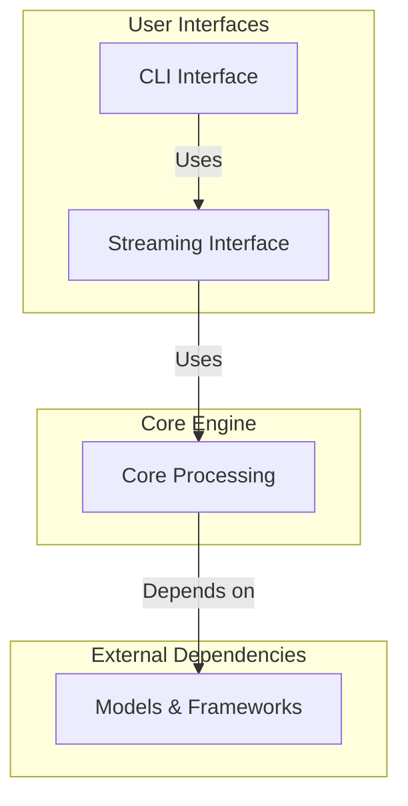

# Component Overview: ViStreamASR

This document provides a comprehensive overview of the ViStreamASR system architecture, components, and their relationships. The system is designed for real-time, streaming automatic speech recognition with optimized performance and user-friendly interfaces.

## System Architecture

ViStreamASR is a modular streaming ASR system composed of four main components:

1. **Core Processing Component** - The heart of the system handling ASR engine functionality
2. **Streaming Interface Component** - High-level user-facing API for streaming speech recognition
3. **CLI Interface Component** - Command-line interface for file transcription and real-time processing
4. **Architecture Framework** - Overall system design and deployment considerations

## Component Relationships



## Component Responsibilities

### Core Processing Component
- **Location**: [`src/core.py`](src/core.py:1)
- **Primary Responsibility**: ASR engine initialization, model management, audio processing, and decoding mechanics
- **Key Classes**: 
  - [`ASREngine`](src/core.py:432) - Core ASR logic management
  - [`IncrementalASR`](src/core.py:346) - Incremental audio processing
- **Features**: Model caching, two-pass decoding, GPU acceleration, error handling

### Streaming Interface Component
- **Location**: [`src/streaming.py`](src/streaming.py:1)
- **Primary Responsibility**: High-level streaming interface for both file and microphone input
- **Key Classes**: 
  - [`StreamingASR`](src/streaming.py:45) - Main streaming interface
- **Features**: Audio format handling, real-time processing, result management

### CLI Interface Component
- **Location**: [`src/cli.py`](src/cli.py:1)
- **Primary Responsibility**: Command-line interface for file transcription and microphone recording
- **Key Functions**: 
  - [`transcribe_file_streaming()`](src/cli.py:52) - File transcription
  - [`transcribe_microphone_streaming()`](src/cli.py:147) - Real-time microphone processing
- **Features**: Progress tracking, error handling, formatted output

## Key Features and Capabilities

### Streaming Capabilities
- **Real-time Processing**: Low-latency streaming with configurable chunk sizes (100-2000ms)
- **File Streaming**: Process audio files in streaming mode with partial and final results
- **Microphone Streaming**: Live speech recognition from audio input devices
- **Incremental Processing**: Context-preserving audio processing for improved accuracy

### Performance Optimizations
- **GPU Acceleration**: Automatic detection and utilization of GPU when available
- **Model Caching**: Efficient model caching to avoid repeated downloads
- **Memory Management**: Optimized buffer management for large audio files
- **RTF Monitoring**: Real-time factor tracking for performance analysis

### Audio Processing
- **Format Support**: WAV, MP3, FLAC, OGG, M4A and more via torchaudio
- **Sample Rate Conversion**: Automatic resampling to 16kHz optimal rate
- **Channel Reduction**: Stereo to mono conversion
- **Normalization**: Amplitude normalization to [-1, 1] range

### Language Model Integration
- **Two-Pass Decoding**: N-gram beam search followed by CLM beam ranking
- **Bidirectional Processing**: Forward and backward encoder outputs for improved accuracy
- **Hypothesis Reranking**: Dynamic reranking based on language model scores
- **Context Preservation**: Maintains context across audio chunks

## Technical Specifications

### System Requirements
- **Python**: 3.8+
- **Memory**: ~5GB RAM for model and processing buffers
- **Storage**: ~2.7GB for cached models
- **GPU**: Optional (recommended for lower latency)

### Performance Metrics
- **Target RTF**: 0.3-0.4x (3-4x faster than real-time on CPU)
- **GPU Acceleration**: 2-5x improvement over CPU
- **Default Latency**: ~640ms with standard chunk settings
- **Audio Quality**: 16kHz sample rate, 16-bit depth

### Configuration Parameters
| Parameter | Default Value | Description |
|-----------|---------------|-------------|
| `chunk_size_ms` | 640ms | Audio chunk duration |
| `max_duration_before_forced_finalization` | 15.0s | Maximum segment duration |
| `decoding_chunk_size` | 16 frames | Processing window size |
| `reverse_weight` | 0.3 | Bidirectional influence |
| `beam_size` | 100 | Beam search width |

## Usage Patterns

### File Processing
```python
from streaming import StreamingASR

# Initialize and process audio file
asr = StreamingASR()
for result in asr.stream_from_file("audio.wav"):
    if result['partial']:
        print(f"Partial: {result['text']}")
    if result['final']:
        print(f"Final: {result['text']}")
```

### Real-time Processing
```python
# Real-time microphone transcription
asr = StreamingASR()
for result in asr.stream_from_microphone():
    print(f"Transcription: {result['text']}")
```

### CLI Usage
```bash
# File transcription
vistream-asr transcribe audio.wav

# Real-time microphone
vistream-asr microphone --duration 30

# System information
vistream-asr info
```

## Integration Points

### API Integration
- **Web Applications**: WebSocket support for real-time transcription
- **Desktop Applications**: Threading support for background processing
- **Mobile Applications**: Audio streaming via HTTP/WebRTC

### System Integration
- **Shell Scripts**: Command-line interface for automation
- **Pipelines**: Unix pipeline support for batch processing
- **System Services**: systemd service configuration for continuous operation

## Error Handling and Resilience

### Error Categories
- **Model Loading Failures**: Network issues, corrupted downloads
- **Audio Processing Errors**: Invalid formats, sample rate mismatches
- **Memory Issues**: GPU out-of-memory, insufficient RAM
- **Device Issues**: Microphone access, audio device conflicts

### Recovery Mechanisms
- **Model Caching**: Automatic retry with cached models
- **Chunk Processing**: Skip problematic chunks while continuing
- **Graceful Degradation**: Fallback to CPU if GPU fails
- **User Feedback**: Clear error messages and troubleshooting guidance

## Development and Maintenance

### Code Organization
```
src/
├── core.py           # Core ASR engine and processing
├── streaming.py      # High-level streaming interface
└── cli.py           # Command-line interface

docs/
├── ARCHITECTURE.md          # System architecture and design
├── COMPONENT_CORE_PROCESSING_DOCS.md     # Core processing documentation
├── COMPONENT_STREAMING_INTERFACE_DOCS.md # Streaming interface documentation
├── COMPONENT_CLI_INTERFACE_DOCS.md       # CLI interface documentation
└── COMPONENT_OVERVIEW.md    # This overview document
```

### Testing Strategy
- **Unit Tests**: Individual component testing
- **Integration Tests**: End-to-end workflow testing
- **Performance Tests**: RTF and accuracy benchmarking
- **Error Scenarios**: Graceful failure testing

## Future Enhancements

### Planned Features
- **Model Support**: Additional language models and custom model loading
- **Advanced Audio Processing**: Noise reduction, voice activity detection
- **Multi-language Support**: Beyond Vietnamese to other languages
- **Cloud Integration**: Cloud-based model hosting and processing

### Performance Improvements
- **Quantization**: Model quantization for reduced memory usage
- **Optimization**: Further RTF improvements and latency reduction
- **Batch Processing**: Enhanced batch processing capabilities
- **Caching Strategies**: Improved model and feature caching

## Related Documentation

- **[`ARCHITECTURE.md`](ARCHITECTURE.md)**: Detailed system architecture and deployment considerations
- **[`COMPONENT_CORE_PROCESSING_DOCS.md`](COMPONENT_CORE_PROCESSING_DOCS.md)**: Core processing implementation details
- **[`COMPONENT_STREAMING_INTERFACE_DOCS.md`](COMPONENT_STREAMING_INTERFACE_DOCS.md)**: Streaming interface API documentation
- **[`COMPONENT_CLI_INTERFACE_DOCS.md`](COMPONENT_CLI_INTERFACE_DOCS.md)**: Command-line interface reference

## Dependencies

### Core Dependencies
- **torch**: Deep learning framework
- **torchaudio**: Audio processing and loading
- **numpy**: Numerical computations
- **sounddevice**: Real-time audio input

### Optional Dependencies
- **cuda**: GPU acceleration (optional)
- **argparse**: Command-line argument parsing
- **requests**: Model downloading and caching

## Conclusion

ViStreamASR provides a comprehensive, modular streaming ASR system designed for real-time applications. The component-based architecture allows for flexible integration and easy extension while maintaining high performance and reliability. The system successfully balances accuracy, latency, and computational efficiency through sophisticated model management, audio processing, and decoding strategies.

For detailed information about specific components, refer to the respective component documentation linked above.