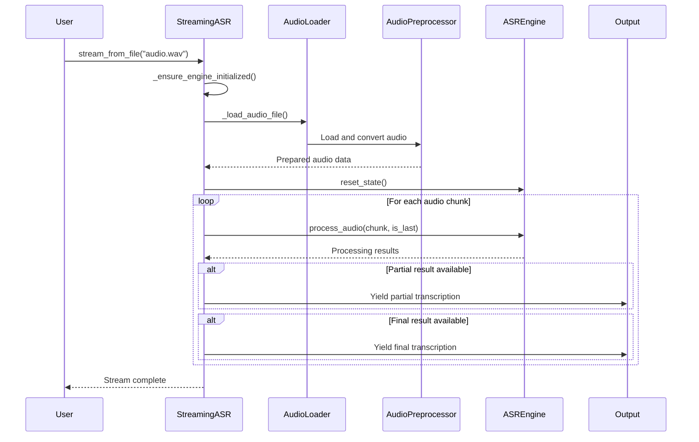
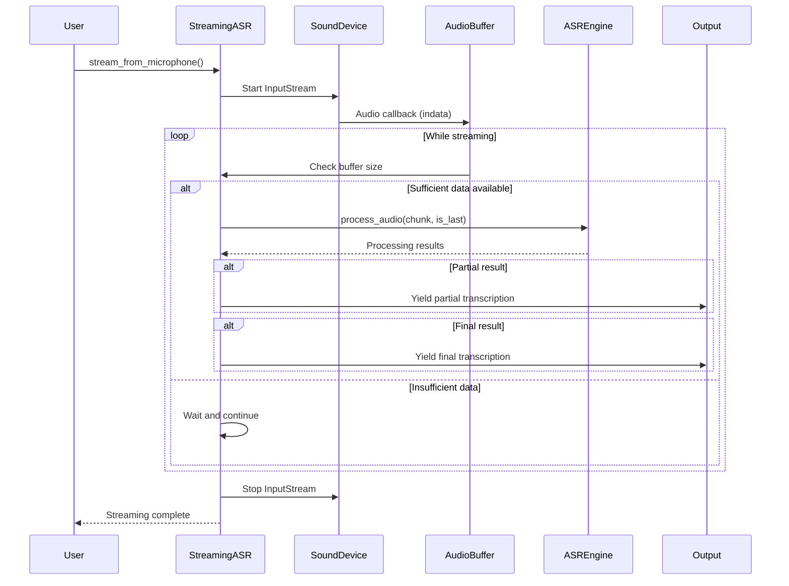

# Component: Streaming Interface Documentation

This document provides comprehensive documentation for the Streaming Interface Component, which provides the high-level user-facing API for streaming speech recognition functionality.

## Overview

The Streaming Interface Component serves as the primary entry point for ViStreamASR functionality, offering:

- **Simple API**: Easy-to-use interface for both file and microphone streaming
- **Audio Format Handling**: Automatic conversion and normalization of input audio
- **Real-time Processing**: Live transcription from microphone input
- **File Streaming**: Chunk-based processing of audio files
- **Result Management**: Handling of partial and final transcription results

## Component Architecture

### Core Classes and Responsibilities

| Class | Location | Primary Responsibility | Key Methods |
|-------|----------|----------------------|-------------|
| `StreamingASR` | [`src/streaming.py:45`](src/streaming.py:45) | High-level streaming interface | `stream_from_file()`, `stream_from_microphone()`, `_ensure_engine_initialized()` |
| `Audio Processing Functions` | [`src/streaming.py:266`](src/streaming.py:266) | Audio loading and preparation | `_load_audio_file()`, `_prepare_audio_for_asr()` |
| `Audio Callback Handler` | [`src/streaming.py:213`](src/streaming.py:213) | Real-time microphone input | `callback()` (nested function) |

## 1. Streaming ASR Interface

### Class Initialization

The `StreamingASR` class provides a configurable interface for streaming speech recognition:

```python
class StreamingASR:
    def __init__(self, chunk_size_ms: int = 640, auto_finalize_after: float = 15.0, debug: bool = False):
        """
        Initialize StreamingASR.
        
        Args:
            chunk_size_ms: Chunk size in milliseconds (default: 640ms for optimal performance)
            auto_finalize_after: Maximum duration in seconds before auto-finalizing a segment (default: 15.0s)
            debug: Enable debug logging
        """
        self.chunk_size_ms = chunk_size_ms
        self.auto_finalize_after = auto_finalize_after
        self.debug = debug
        self.engine = None
```

**Key Configuration Parameters:**
- **chunk_size_ms**: Controls the duration of audio chunks processed (640ms default)
- **auto_finalize_after**: Maximum time before automatic segment finalization (15s default)
- **debug**: Enables detailed logging for troubleshooting

### Lazy Engine Initialization

The interface implements lazy initialization to optimize startup performance:

```python
def _ensure_engine_initialized(self):
    """Lazy initialization of the ASR engine."""
    if self.engine is None:
        if self.debug:
            print(f"{symbols['tool']} [StreamingASR] Initializing ASR engine...")
        
        self.engine = ASREngine(
            chunk_size_ms=self.chunk_size_ms,
            max_duration_before_forced_finalization=self.auto_finalize_after,
            debug_mode=self.debug
        )
        self.engine.initialize_models()
        
        if self.debug:
            print(f"{symbols['check']} [StreamingASR] ASR engine ready")
```

**Benefits:**
- **Faster Startup**: Models are loaded only when needed
- **Memory Efficiency**: Reduces memory footprint when not actively processing
- **Error Isolation**: Engine initialization failures don't prevent object creation

## 2. File Streaming Workflow

### Stream Processing Architecture

The file streaming method processes audio files in configurable chunks, providing real-time feedback:

```python
def stream_from_file(self, audio_file: str, chunk_size_ms: Optional[int] = None) -> Generator[Dict[str, Any], None, None]:
    """
    Stream ASR results from an audio file.
    
    Args:
        audio_file: Path to audio file
        chunk_size_ms: Override chunk size for this session
        
    Yields:
        dict: Results with keys:
            - 'partial': True if partial transcription
            - 'final': True if final transcription  
            - 'text': Transcription text
            - 'chunk_info': Processing info (samples, duration, etc.)
    """
    self._ensure_engine_initialized()
    
    chunk_size = chunk_size_ms or self.chunk_size_ms
    
    if self.debug:
        print(f"{symbols['wave']} [StreamingASR] Starting file stream: {audio_file}")
        print(f"{symbols['ruler']} [StreamingASR] Chunk size: {chunk_size}ms")
    
    # Load and prepare audio
    audio_data = self._load_audio_file(audio_file)
    if audio_data is None:
        return
```

### File Streaming Sequence



### Audio File Processing

The system handles various audio formats and automatically prepares them for ASR processing:

```python
def _load_audio_file(self, audio_file: str) -> Optional[Dict[str, Any]]:
    """Load and prepare audio file for ASR processing."""
    if not os.path.exists(audio_file):
        if self.debug:
            print(f"{symbols['folder']} [StreamingASR] File not found: {audio_file}")
        return None
    
    try:
        if self.debug:
            print(f"{symbols['folder']} [StreamingASR] Loading: {audio_file}")
        
        # Load with torchaudio
        waveform, original_sr = torchaudio.load(audio_file)
        
        # Convert to mono if stereo
        if waveform.shape[0] > 1:
            waveform = waveform.mean(dim=0, keepdim=True)
            if self.debug:
                print(f"{symbols['tool']} [StreamingASR] Converted stereo to mono")
        
        # Prepare audio for ASR (convert to 16kHz and normalize)
        prepared_audio = self._prepare_audio_for_asr(waveform.squeeze(), original_sr)
        
        duration = len(waveform.squeeze()) / original_sr
        
        if self.debug:
            print(f"{symbols['check']} [StreamingASR] Audio prepared: {len(prepared_audio)} samples at 16kHz")
        
        return {
            'waveform': prepared_audio,
            'original_sample_rate': original_sr,
            'duration': duration
        }
    except Exception as e:
        if self.debug:
            print(f"{symbols['folder']} [StreamingASR] Error loading audio file: {e}")
        return None
```

**Audio Processing Pipeline:**
1. **File Validation**: Check file existence and accessibility
2. **Format Detection**: Automatic format detection using torchaudio
3. **Channel Conversion**: Stereo to mono conversion if needed
4. **Resampling**: Convert to 16kHz target sample rate
5. **Normalization**: Amplitude normalization to [-1, 1] range
6. **Metadata Extraction**: Duration and original sample rate tracking

### Audio Preparation for ASR

The system ensures audio is properly formatted for the ASR engine:

```python
def _prepare_audio_for_asr(self, audio_data, sample_rate):
    """Prepare audio data for ASR engine (convert to 16kHz mono and normalize)."""
    target_sample_rate = 16000
    
    # Convert to tensor if needed
    if not isinstance(audio_data, torch.Tensor):
        audio_tensor = torch.tensor(audio_data, dtype=torch.float32)
    else:
        audio_tensor = audio_data.float()
    
    # Convert stereo to mono if needed
    if len(audio_tensor.shape) > 1:
        audio_tensor = audio_tensor.mean(axis=0)
    
    # Resample if needed
    if sample_rate != target_sample_rate:
        if len(audio_tensor.shape) == 1:
            audio_tensor = audio_tensor.unsqueeze(0)  # Add batch dimension
        
        resampler = torchaudio.transforms.Resample(sample_rate, target_sample_rate)
        audio_tensor = resampler(audio_tensor).squeeze()
    
    # Normalize
    max_val = torch.max(torch.abs(audio_tensor))
    if max_val > 0:
        audio_tensor = audio_tensor / max_val
    
    # Convert back to numpy
    return audio_tensor.numpy()
```

### Chunked Processing Implementation

The file streaming divides audio into manageable chunks for processing:

```python
# Calculate chunk parameters
chunk_size_samples = int(16000 * chunk_size / 1000.0)
total_chunks = (len(prepared_audio) + chunk_size_samples - 1) // chunk_size_samples

if self.debug:
    print(f"{symbols['check']} [StreamingASR] Processing {total_chunks} chunks of {chunk_size_samples} samples each")

# Process chunks
start_time = time.time()

for i in range(total_chunks):
    start_sample = i * chunk_size_samples
    end_sample = min(start_sample + chunk_size_samples, len(prepared_audio))
    chunk = prepared_audio[start_sample:end_sample]
    
    is_last = (i == total_chunks - 1)
    
    if self.debug:
        print(f"\n{symbols['tool']} [StreamingASR] Processing chunk {i+1}/{total_chunks} ({len(chunk)} samples)")
    
    # Process chunk
    result = self.engine.process_audio(chunk, is_last=is_last)
```

**Chunk Processing Logic:**
- **Dynamic Chunking**: Calculates optimal chunk size based on sample rate
- **Boundary Handling**: Properly handles the final chunk (which may be shorter)
- **Progress Tracking**: Detailed logging of processing progress
- **Performance Monitoring**: Tracks total processing time and RTF

### Result Format and Management

The streaming interface provides structured results for both partial and final transcriptions:

```python
# Prepare output
chunk_info = {
    'chunk_id': i + 1,
    'total_chunks': total_chunks,
    'samples': len(chunk),
    'duration_ms': len(chunk) / 16000 * 1000,
    'is_last': is_last
}

# Yield partial results
if result.get('current_transcription'):
    yield {
        'partial': True,
        'final': False,
        'text': result['current_transcription'],
        'chunk_info': chunk_info
    }

# Yield final results
if result.get('new_final_text'):
    yield {
        'partial': False,
        'final': True,
        'text': result['new_final_text'],
        'chunk_info': chunk_info
    }
```

**Result Structure:**
- **partial**: Boolean indicating if this is a partial result
- **final**: Boolean indicating if this is a final result
- **text**: The transcribed text
- **chunk_info**: Detailed processing metadata

## 3. Real-time Microphone Processing

### Microphone Streaming Architecture

The microphone streaming provides real-time speech recognition from audio input devices:

```python
def stream_from_microphone(self, duration_seconds: Optional[float] = None) -> Generator[Dict[str, Any], None, None]:
    """
    Stream ASR results from microphone input.

    Args:
        duration_seconds: Maximum duration to record (None for infinite)

    Yields:
        dict: Same format as stream_from_file()
    """
    self._ensure_engine_initialized()
    samplerate = 16000
    chunk_size = self.chunk_size_ms
    chunk_size_samples = int(samplerate * chunk_size / 1000.0)
    if self.debug:
        print(
            f"{symbols['wave']} [StreamingASR] Starting microphone stream at {samplerate}Hz, chunk size: {chunk_size}ms ({chunk_size_samples} samples)")
    self.engine.reset_state()
    start_time = time.time()
    buffer = np.zeros((0,), dtype=np.float32)
    chunk_id = 0
```

### Real-time Audio Callback

The system uses a callback-based approach for continuous audio processing:

```python
def callback(indata, frames, time_info, status):
    nonlocal buffer
    if status:
        print(status, file=sys.stderr)
    buffer = np.concatenate((buffer, indata[:, 0]))
```

**Callback Features:**
- **Continuous Buffering**: Accumulates audio data in a rolling buffer
- **Error Handling**: Captures and reports audio device status
- **Channel Selection**: Uses first channel (mono conversion)
- **Memory Efficiency**: NumPy arrays for efficient audio storage

### Microphone Processing Sequence



### Real-time Processing Logic

The microphone streaming implements sophisticated buffer management:

```python
with sd.InputStream(samplerate=samplerate, channels=1, dtype='float32', callback=callback):
    while True:
        if duration_seconds is not None and (time.time() - start_time) > duration_seconds:
            is_last = True
        else:
            is_last = False
        if len(buffer) >= chunk_size_samples or is_last:
            chunk = buffer[:chunk_size_samples]
            buffer = buffer[chunk_size_samples:]
            if len(chunk) == 0:
                if is_last:
                    break
                else:
                    time.sleep(0.01)
                    continue
            chunk_id += 1
            if self.debug:
                print(
                    f"{symbols['tool']} [StreamingASR] Processing mic chunk {chunk_id} ({len(chunk)} samples)")
            result = self.engine.process_audio(chunk, is_last=is_last)
            chunk_info = {
                'chunk_id': chunk_id,
                'samples': len(chunk),
                'duration_ms': len(chunk) / samplerate * 1000,
                'is_last': is_last
            }
            if result.get('current_transcription'):
                yield {
                    'partial': True,
                    'final': False,
                    'text': result['current_transcription'],
                    'chunk_info': chunk_info
                }
            if result.get('new_final_text'):
                yield {
                    'partial': False,
                    'final': True,
                    'text': result['new_final_text'],
                    'chunk_info': chunk_info
                }
            if is_last:
                break
        else:
            time.sleep(0.01)
    if self.debug:
        print(f"{symbols['check']} [StreamingASR] Microphone streaming complete.")

### Buffer Management Strategy

The microphone streaming implements intelligent buffer management:

```python
# Rolling buffer implementation
buffer = np.zeros((0,), dtype=np.float32)

# Buffer consumption logic
if len(buffer) >= chunk_size_samples or is_last:
    chunk = buffer[:chunk_size_samples]  # Take chunk from front
    buffer = buffer[chunk_size_samples:]  # Remove consumed portion
```

**Buffer Management Features:**
- **Rolling Buffer**: Continuous accumulation of audio data
- **Precise Chunking**: Exactly sized chunks for consistent processing
- **Zero-Loss Processing**: No audio data is lost between chunks
- **Memory Efficiency**: Buffer size grows only with processing requirements

### Microphone Device Handling

The system includes robust microphone device detection and handling:

```python
# Check if microphone is available (from CLI integration)
try:
    import sounddevice as sd
    devices = sd.query_devices()
    input_devices = [d for d in devices if d['max_input_channels'] > 0]
    if not input_devices:
        print(f"❌ Error: No microphone devices found")
        return 1
    print(f"{symbols['check']} Found {len(input_devices)} microphone device(s)")
except ImportError:
    print(f"❌ Error: sounddevice library not installed. Install with: pip install sounddevice")
    return 1
except Exception as e:
    print(f"❌ Error checking microphone: {e}")
    return 1
```

**Device Management Features:**
- **Automatic Detection**: Finds all available input devices
- **Capability Validation**: Ensures devices support audio input
- **Error Handling**: Graceful handling of device access issues
- **User Feedback**: Clear information about available devices

## 4. Audio Preprocessing and Format Conversion

### Audio Format Support

The streaming interface supports a wide range of audio formats through torchaudio:

```python
# Format detection and loading
waveform, original_sr = torchaudio.load(audio_file)
```

**Supported Formats:**
- **WAV**: Uncompressed PCM audio
- **MP3**: Compressed MPEG audio
- **FLAC**: Free Lossless Audio Codec
- **OGG**: Ogg Vorbis compression
- **M4A**: MPEG-4 audio files
- **And more**: Any format supported by torchaudio

### Audio Normalization Pipeline

The system implements comprehensive audio normalization:

```python
def _prepare_audio_for_asr(self, audio_data, sample_rate):
    """Prepare audio data for ASR engine (convert to 16kHz mono and normalize)."""
    target_sample_rate = 16000
    
    # Convert to tensor if needed
    if not isinstance(audio_data, torch.Tensor):
        audio_tensor = torch.tensor(audio_data, dtype=torch.float32)
    else:
        audio_tensor = audio_data.float()
    
    # Convert stereo to mono if needed
    if len(audio_tensor.shape) > 1:
        audio_tensor = audio_tensor.mean(axis=0)
    
    # Resample if needed
    if sample_rate != target_sample_rate:
        if len(audio_tensor.shape) == 1:
            audio_tensor = audio_tensor.unsqueeze(0)  # Add batch dimension
        
        resampler = torchaudio.transforms.Resample(sample_rate, target_sample_rate)
        audio_tensor = resampler(audio_tensor).squeeze()
    
    # Normalize
    max_val = torch.max(torch.abs(audio_tensor))
    if max_val > 0:
        audio_tensor = audio_tensor / max_val
    
    # Convert back to numpy
    return audio_tensor.numpy()
```

**Normalization Steps:**
1. **Type Conversion**: Ensure consistent float32 tensor format
2. **Channel Reduction**: Convert multi-channel audio to mono
3. **Sample Rate Conversion**: Resample to 16kHz (optimal for ASR)
4. **Amplitude Normalization**: Scale to [-1, 1] range
5. **Format Conversion**: Return NumPy array for engine compatibility

### Resampling Implementation

The system uses high-quality resampling for optimal ASR performance:

```python
# High-quality resampling
resampler = torchaudio.transforms.Resample(sample_rate, target_sample_rate)
audio_tensor = resampler(audio_tensor).squeeze()
```

**Resampling Features:**
- **Quality**: Uses torchaudio's high-quality sinc interpolation
- **Efficiency**: Optimized for real-time processing
- **Compatibility**: Handles various input sample rates
- **Preservation**: Maintains audio quality during conversion

## 5. Error Handling and Resilience

### File Processing Error Handling

The streaming interface includes comprehensive error handling for file operations:

```python
def _load_audio_file(self, audio_file: str) -> Optional[Dict[str, Any]]:
    """Load and prepare audio file for ASR processing."""
    if not os.path.exists(audio_file):
        if self.debug:
            print(f"{symbols['folder']} [StreamingASR] File not found: {audio_file}")
        return None
    
    try:
        # File loading and processing
        # ...
    except Exception as e:
        if self.debug:
            print(f"{symbols['folder']} [StreamingASR] Error loading audio file: {e}")
        return None
```

**Error Handling Categories:**
- **File System Errors**: Missing files, permission issues
- **Format Errors**: Corrupted or unsupported audio formats
- **Memory Errors**: Large files causing memory issues
- **Processing Errors**: Audio processing failures

### Real-time Error Handling

Microphone streaming includes robust error handling for live audio processing:

```python
def callback(indata, frames, time_info, status):
    nonlocal buffer
    if status:
        print(status, file=sys.stderr)  # Report device status issues
    buffer = np.concatenate((buffer, indata[:, 0]))
```

**Real-time Error Handling:**
- **Device Status**: Reports audio device issues immediately
- **Buffer Management**: Handles audio buffer overflow/underflow
- **Processing Continuity**: Maintains streaming despite temporary errors
- **User Feedback**: Provides clear error messages to users

## 6. Performance Optimization

### Memory Management

The streaming interface implements several memory optimization strategies:

```python
# Efficient buffer management
buffer = np.zeros((0,), dtype=np.float32)  # Initial empty buffer

# Precise chunk consumption
chunk = buffer[:chunk_size_samples]  # Take exact chunk size
buffer = buffer[chunk_size_samples:]  # Remove consumed portion
```

**Memory Optimization Features:**
- **Rolling Buffers**: Minimal memory footprint for audio data
- **Precise Allocation**: Exact chunk sizing reduces waste
- **Garbage Collection**: Automatic cleanup of temporary objects
- **Stream Processing**: Processes data in chunks rather than loading entire files

### Latency Optimization

The interface is optimized for low-latency streaming applications:

```python
# Real-time processing parameters
chunk_size_samples = int(samplerate * chunk_size / 1000.0)
# Default: 640ms chunks = 10240 samples at 16kHz
```

**Latency Optimization Strategies:**
- **Configurable Chunk Sizes**: Balance between latency and accuracy
- **Direct Audio Processing**: Minimizes intermediate processing steps
- **Efficient Data Structures**: NumPy arrays for fast audio manipulation
- **Parallel Processing**: Overlaps audio loading with processing

### Debug and Monitoring

Comprehensive debugging capabilities for troubleshooting and optimization:

```python
if self.debug:
    print(f"{symbols['wave']} [StreamingASR] Starting microphone stream at {samplerate}Hz, chunk size: {chunk_size}ms ({chunk_size_samples} samples)")
    # Detailed logging throughout processing
```

**Debug Features:**
- **Progress Tracking**: Real-time processing status updates
- **Performance Metrics**: Chunk processing times and buffer status
- **Audio Quality Monitoring**: Sample rate and normalization information
- **Error Diagnostics**: Detailed error messages and stack traces

## 7. Usage Examples

### Basic File Streaming

```python
from streaming import StreamingASR

# Initialize with default settings
asr = StreamingASR()

# Stream process an audio file
for result in asr.stream_from_file("audio.wav"):
    if result['partial']:
        print(f"Partial: {result['text']}")
    if result['final']:
        print(f"Final: {result['text']}")
```

### Custom File Streaming

```python
# Custom configuration for low latency
asr = StreamingASR(
    chunk_size_ms=300,      # 300ms chunks for lower latency
    auto_finalize_after=10.0, # Finalize segments after 10 seconds
    debug=True              # Enable detailed logging
)

# Process with custom chunk size
for result in asr.stream_from_file("speech.mp3", chunk_size_ms=500):
    if result.get('text'):
        chunk_info = result.get('chunk_info', {})
        print(f"[{chunk_info.get('chunk_id')}] {result['text']}")
```

### Real-time Microphone Streaming

```python
# Real-time microphone transcription
asr = StreamingASR(
    chunk_size_ms=640,
    debug=True
)

print("Starting real-time transcription... Speak now!")
print("Press Ctrl+C to stop")

try:
    for result in asr.stream_from_microphone():
        if result['partial']:
            print(f"\rPartial: {result['text']}", end='', flush=True)
        elif result['final']:
            print(f"\nFinal: {result['text']}")
except KeyboardInterrupt:
    print("\nStreaming stopped by user")
```

### Advanced Usage with Error Handling

```python
import sys
from streaming import StreamingASR

def transcribe_file_safely(audio_file):
    """Safely transcribe an audio file with comprehensive error handling."""
    try:
        asr = StreamingASR(debug=True)
        
        if not os.path.exists(audio_file):
            print(f"Error: File '{audio_file}' not found")
            return None
        
        final_text = ""
        partial_text = ""
        
        for result in asr.stream_from_file(audio_file):
            if result['partial']:
                partial_text = result['text']
                print(f"Processing... {partial_text}")
            
            if result['final']:
                final_text += result['text'] + " "
                print(f"Segment: {result['text']}")
        
        return final_text.strip()
        
    except Exception as e:
        print(f"Error during transcription: {e}")
        return None

# Usage
transcription = transcribe_file_safely("presentation.wav")
if transcription:
    print(f"\nComplete transcription: {transcription}")
```

## 8. Integration Patterns

### With Web Applications

```python
from streaming import StreamingASR
import asyncio

class StreamingASRService:
    def __init__(self):
        self.asr = StreamingASR(chunk_size_ms=500, debug=False)
        self.is_processing = False
    
    async def process_audio_stream(self, audio_stream):
        """Process streaming audio from a web application."""
        self.is_processing = True
        
        try:
            async for audio_chunk in audio_stream:
                # Convert web audio format to numpy array
                chunk_data = self._convert_web_audio(audio_chunk)
                
                # Process with ASR engine
                result = self.asr.engine.process_audio(chunk_data, is_last=False)
                
                if result.get('current_transcription'):
                    yield {
                        'type': 'partial',
                        'text': result['current_transcription']
                    }
        
        finally:
            self.is_processing = False
```

### With Desktop Applications

```python
import threading
from streaming import StreamingASR

class DesktopASRIntegration:
    def __init__(self):
        self.asr = StreamingASR(debug=True)
        self.transcription_callback = None
    
    def start_background_processing(self, audio_data):
        """Start ASR processing in a background thread."""
        def process_audio():
            try:
                for result in self.asr.stream_from_file(audio_data):
                    if self.transcription_callback:
                        self.transcription_callback(result)
            except Exception as e:
                print(f"Processing error: {e}")
        
        thread = threading.Thread(target=process_audio)
        thread.daemon = True
        thread.start()
        return thread
```

## 9. Configuration and Customization

### Key Configuration Parameters

| Parameter | Default Value | Range | Description |
|-----------|---------------|-------|-------------|
| `chunk_size_ms` | 640ms | 100-2000ms | Audio chunk duration |
| `auto_finalize_after` | 15.0s | 5.0-60.0s | Maximum segment duration |
| `debug` | False | Boolean | Enable debug logging |

### Performance Optimization Settings

```python
# Low-latency configuration (300ms chunks, 10s auto-finalize)
asr = StreamingASR(
    chunk_size_ms=300,
    auto_finalize_after=10.0,
    debug=False
)

# High-accuracy configuration (1000ms chunks, 30s auto-finalize)
asr = StreamingASR(
    chunk_size_ms=1000,
    auto_finalize_after=30.0,
    debug=True
)
```

### Debug Configuration

```python
# Maximum debug information
asr = StreamingASR(
    chunk_size_ms=640,
    debug=True
)

# Silent operation (no debug output)
asr = StreamingASR(
    chunk_size_ms=640,
    debug=False
)
```

## 10. Summary

The Streaming Interface Component provides a comprehensive, easy-to-use API for streaming speech recognition with:

- **Simple High-Level API**: Intuitive interface for both file and microphone streaming
- **Robust Audio Processing**: Automatic format conversion, normalization, and resampling
- **Real-time Performance**: Optimized for low-latency streaming applications
- **Error Resilience**: Comprehensive error handling and recovery mechanisms
- **Flexible Configuration**: Tunable parameters for different use cases
- **Debugging Support**: Detailed logging and monitoring capabilities
- **Integration Ready**: Designed for easy integration with various applications

The component successfully abstracts the complexity of the underlying ASR engine while providing powerful streaming capabilities suitable for both file processing and real-time microphone applications.

## Related Files

- **[`src/streaming.py`](src/streaming.py)**: Main streaming interface implementation
- **[`src/core.py`](src/core.py)**: Core ASR engine and processing logic
- **[`src/cli.py`](src/cli.py)**: Command-line interface using the streaming component

## Dependencies

- **torchaudio**: Audio loading and processing
- **sounddevice**: Real-time microphone input
- **numpy**: Efficient audio buffer management
- **torch**: Underlying deep learning framework